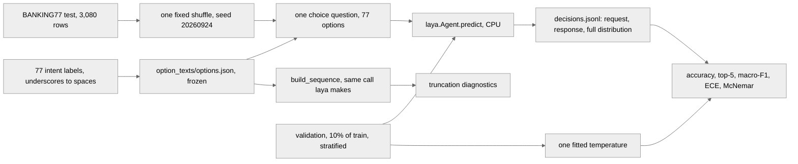

# Does Laya's Banking77 failure come from its token budget?

An inference-only experiment. **Nothing here is trained.**

Convai's model card reports **Laya at 0.425 on Banking77** against Jev's 0.870, and blames the
token budget: every option is scored at its own `[MASK]` token, all the options share one
`head_max_len` budget, and 77 options therefore get about three or four tokens each. This
experiment asks whether that explanation holds, using configuration alone.

## What was verified before any code was written

Against the installed `laya` **0.3.7** (`.venv/Lib/site-packages/laya/`), the three checkpoint
configs under `C:\projects\jev_demo\arena\models\laya\`, and both the local and the live copy of
the model card:

| Claim | Verdict |
|---|---|
| English checkpoint: 512 context, `head_max_len = 192` | **confirmed**, `rl_agent_config.json` |
| Multilingual and typed-decisions: 1,024 context, `head_max_len = 256` | **confirmed**, both subfolder configs |
| The published 0.425 is at the 256-token head budget | **as documented** — but see the contradiction below |
| `head_max_len` can be raised at inference | **confirmed**: `Agent.system_one` reads `self.cfg["head_max_len"]` and `self.cfg["max_len"]` on every call, so assigning to `agent.cfg` takes effect on the next prediction. No reload, no retrain |

Two things the card gets wrong, both found by reading `laya/common.py::build_sequence`:

- **The per-option budget has a floor of four tokens**: `per = max(4, (head_max_len - 16) // n_options)`.
  At 77 options, `(256-16)//77` is 3 and `(192-16)//77` is 2, so *both* get clamped to 4. The English
  192 and the multilingual 256 hand 77 options **exactly the same room**. The card presents them as
  different budgets; at this option count they are not.
- **The floor can overrun the budget it is meant to enforce.** 77 options x 4 tokens is 308, which
  does not fit in `head_max_len = 192` at all. The instruction text is squeezed to 8 tokens instead.

And one contradiction inside the card itself: the 0.425 is listed in a table whose Laya column is
"what `Router().predict(...)` returns", and the router sends English text to the **English**
checkpoint (192), while the prose two sections later attributes the same number to the **256**-token
budget. Arm A runs the 256 configuration the prose names; **arm E runs the English checkpoint** so
the checkpoint choice is measured rather than argued about.

## The design



| Arm | What it is | What it tests |
|---|---|---|
| **A-default** | multilingual, 256 / 1024, 77 options | does the published 0.425 reproduce? |
| **B-384 / B-512 / B-768** | the same, budget raised, `max_len` raised to fit | does room alone recover accuracy? |
| **K-10 / K-20 / K-40** | default budget, fewer intents, same examples restricted to those labels | does accuracy track *tokens per option* or task difficulty? |
| **C-coarse-fine** | default budget, 11 coarse groups then the intent inside the chosen group | is the documented workaround better than raising the budget? |
| **E-english** | English checkpoint at its own 192 / 512 | how much does the checkpoint alone move it? |

Arm A doubles as the 256 rung of the budget sweep and the 77-option rung of the option sweep, so it
is run once and read three ways.

**Everything reported comes from the test split.** The only fitted quantity is one temperature, and
it is fitted on a 90/10 stratified split carved out of **train**. Options are the bare intent labels
with underscores replaced by spaces — no hand-written descriptions, because descriptions would make
every option longer and the truncation worse, and the diagnostics will say whether label text is the
binding constraint at all.

## The truncation diagnostics

Read off the sequence `laya.common.build_sequence` itself builds, not off a re-implementation of it.
`banking77/budget.py` cuts the option spans out of that sequence at the marker positions laya
returns, and decodes them back to text. At the default budget:

| `head_max_len` | mean text tokens per option | options truncated | options that collapse onto another | identical pairs |
|---|---|---|---|---|
| **256 (arm A)** | 2.74 | 35.1% | 7 | **5** |
| 384 | 3.32 | 0% | 0 | 0 |
| 512 | 3.32 | 0% | 0 | 0 |
| 768 | 3.32 | 0% | 0 | 0 |

The five pairs the model cannot possibly separate at the default budget:

```
" balance not updated"  <-  balance not updated after bank transfer
                            balance not updated after cheque or cash deposit
" lost or stolen"       <-  lost or stolen card
                            lost or stolen phone
" top up by"            <-  top up by bank transfer charge
                            top up by card charge
                            top up by cash or cheque
```

Note what the sweep already shows before a single forward pass: **at 384 nothing truncates at all**,
so 384, 512 and 768 build a byte-identical request. The budget sweep has two distinct points, not
four. They are all still run, because a prediction that three arms will agree is worth checking
rather than asserting.

## Pilot: arm A on 200 examples

200 test examples drawn from the shared shuffle, covering 68 of the 77 intents.

| | measured | published |
|---|---|---|
| accuracy | **0.435** (95% CI 0.365–0.505, 1,000 bootstrap resamples) | 0.425 |
| top-5 accuracy | 0.635 | — |
| macro-F1 | 0.345 | — |
| ECE, 15 bins, raw | 0.336 | — |
| ECE after one fitted temperature (T = 2.17, fitted on 200 validation rows) | 0.120 | — |

The published 0.425 sits inside the confidence interval. **Arm A reproduces.**

### Latency

**Every latency here is CPU.** This machine has no usable GPU (`torch.cuda.is_available()` is
false, torch 2.14.0+cpu). Convai's published 33 ms is a T4 figure and is not comparable to anything
in this directory.

The pilot's recorded p50 is 2,093 ms and p95 is 2,843 ms, but the machine was contended for the
first 150 calls; over the last 200 calls the p50 is **344 ms** and the p95 is **460 ms**. Both are
reported because the first number is what the run actually measured and the second is what the
machine does when nothing else is running.

### One complete record

Every prediction appends one line to `runs/<tag>/decisions.jsonl` holding the exact request, the
exact response and the **full** 77-way distribution. One of them, abridged only where noted:

```json
{
  "arm": "A-default", "example_id": "test-1215", "split": "test",
  "text": "The app will not let me into my account.",
  "gold": "unable_to_verify_identity",
  "n_options": 77, "head_max_len": 256, "max_len": 1024, "checkpoint": "multilingual",
  "prediction": "compromised_card",
  "request": {
    "state": "The app will not let me into my account.",
    "questions": {"intent": {
      "type": "choice",
      "instructions": "Which banking intent does this customer message express?",
      "criteria": {"Refund not showing up": null, "activate my card": null, "age limit": null,
                   "apple pay or google pay": null, "atm support": null, "...72 more": null}}}
  },
  "response": {
    "model": "laya-rl-agent",
    "answers": {"intent": {
      "type": "choice", "choice": "compromised card", "confidence": 0.8916,
      "probabilities": {"compromised card": 0.9246, "terminate account": 0.0278,
                        "apple pay or google pay": 0.0095, "activate my card": 0.0071,
                        "unable to verify identity": 0.0017, "...72 more": 0.0},
      "action": {"act_probability": 1.0}}},
    "usage": {"input_tokens": 310, "output_tokens": 0}
  },
  "confidence": 0.8916, "latency_ms": 2035.6
}
```

0.92 probability on the wrong intent, 0.0017 on the right one. The over-confidence is the model
card's own documented behaviour, and it is what the fitted temperature is for.

## Running it

```bash
python -m banking77.run --arms A-default --limit 200 --tag pilot   # the pilot
python -m banking77.run --arms all --tag full                      # the whole sweep
python -m banking77.report --tag pilot
```

`--limit` takes the first N of the **shared shuffle**, not the first N rows: BANKING77 ships its
splits ordered by label, so an unshuffled limit of 200 hands you five intents out of 77 and calls
the result accuracy. That mistake was made once here and caught by the label count.

A run is **resumable**. One record per (arm, example) goes into `runs/<tag>/decisions.jsonl`, and a
restart skips whatever is already there, exactly as `rerank/store.py` does. `runs/` is gitignored;
`results/` and `option_texts/` are not.

`config.json` next to each run records the laya, torch, transformers and Python versions, the
checkpoint paths, the CPU, every seed and every hyperparameter.

### Projected wall clock for the full sweep

From the pilot's steady-state 344 ms per 77-option call on this CPU, and 4,083 calls per full arm
(3,080 test + 1,003 validation):

| arm | calls | projected |
|---|---|---|
| A-default | 4,083 | 23 min |
| B-384, B-512, B-768 | 4,083 each | 27 min each |
| K-10, K-20, K-40 | 530 / 1,060 / 2,120 | ~10 min total |
| C-coarse-fine | 8,166 (two steps) | 16 min |
| E-english | 4,083 | 61 min (ModernBERT-large is ~2.7x slower per call here) |
| **total** | | **~3.2 hours**, or up to ~10 hours if the machine stays as contended as it was for the pilot's first third |

Runnable here overnight. It does not need a GPU.

## Files

- **`data.py`** — BANKING77 from PolyAI's own CSVs, the identical files the `PolyAI/banking77`
  loading script downloads. That repo ships only a Python script and has no parquet conversion, so
  `datasets` would have to execute remote code to read four thousand rows. Also the stratified
  train/validation split and the one shared shuffle.
- **`options.py`** — the 77 labels, the option texts, the 11 coarse groups for arm C. All frozen to
  `option_texts/options.json` **before** anything ran; re-freezing a different order raises.
- **`budget.py`** — the truncation diagnostics, cut out of laya's own sequence.
- **`metrics.py`** — accuracy, top-5, macro-F1, ECE, bootstrap CI, temperature fit, McNemar. Plain
  Python and numpy; no scipy for forty lines. Temperature is fitted on `log(p)` of the recorded
  distribution, which is the standard temperature-scaling family applied to laya's logits.
- **`hierarchy.py`** — arm C's two steps and the joint distribution.
- **`store.py`** — the append-and-flush JSONL log, which doubles as the resume point.
- **`arms.py`**, **`run.py`**, **`report.py`** — the arms, the task and the numbers.
- **`tests/`** — 76 tests, all pure logic, run with the repo's suite.

## Honesty

- Every number above is from a run on this machine. The only carried-over figures are Convai's
  published 0.425 and 0.870, labelled as published everywhere they appear.
- The published Jev 0.870 was scored on **72** labels and Laya's 0.425 on **77**. They are not the
  same task and this experiment does not measure Jev at all.
- The English checkpoint ships `choice:11+` temperature 0.1006, which laya clamps to 0.5 with a
  runtime warning. Arm E's probabilities are therefore deliberately sharpened by the checkpoint
  before anything here sees them, and its raw ECE has to be read with that in mind. The multilingual
  checkpoint carries no per-option temperatures at all, so arm A's distribution is the plain softmax.
- Arm C reports the fine step's answer as its prediction, not the joint argmax. Taking the joint
  argmax would quietly undo the commitment the coarse step made, and the arm would stop being the
  workaround anyone would deploy.
- If the budget hypothesis fails, it will be reported as failing.
