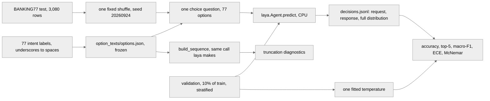

# Does Laya's Banking77 failure come from its token budget?

**Status:** `complete`. Results in [RESULTS.md](RESULTS.md).

Results so far: [RESULTS.md](RESULTS.md). This file is the protocol. An inference-only experiment: **nothing here is trained.**

## The question

Is Laya's published 0.425 on Banking77 explained by the shared `head_max_len` option budget, which at 77 options leaves each option about four tokens?

## Motivation

Convai's model card reports **Laya at 0.425 on Banking77** against Jev's 0.870, and blames the token budget: every option is scored at its own `[MASK]` token, all the options share one `head_max_len` budget, and 77 options therefore get about three or four tokens each.

What changes depending on the answer. If room alone recovers the accuracy, the published number is a configuration artifact and anyone deploying Laya on a wide label set should raise the budget, which costs nothing but context. If it does not, the number is a capability limit and the documented coarse-to-fine workaround is the only lever left. The two have opposite consequences for anyone choosing between a decision model and an LLM on a 77-way classification, which is the comparison the sibling experiments are for.

## What we expect

The hypothesis under test is Convai's, stated in their model card and quoted above: the budget explains the failure. The arms exist to make it falsifiable.

Where the expectations are recorded in this repository, all of them in the harness that produced the pilot:

- **The budget hypothesis, stated as something evidence can settle**, in the module docstring of `banking77/budget.py`: *"The count that matters is `identical_pairs`. Two labels that truncate to the same string cannot be told apart by any amount of capability, so that number is the budget hypothesis stated as evidence rather than as a claim."*
- **What each arm is expected to separate**, in `banking77/arms.py`, both in the docstring and in the comments over each arm block: *"B: does room alone recover accuracy? Only the budget moves."* The arm table below carries the same column.
- **The prediction that three arms will produce a byte-identical request**, in this protocol and in commit `47eae3b`: *"At 384 nothing truncates, so 384, 512 and 768 build a byte-identical request; they are still all run rather than asserted equal."* This one is checkable without a forward pass and is checked in [RESULTS.md](RESULTS.md).
- **What would make the option text the wrong suspect**, in `banking77/options.py`: *"Descriptions would make every option longer and so make the truncation worse, and the point of the experiment is to find out whether the label text is the binding constraint at all."*

**What would falsify the hypothesis:** arms B-384, B-512 and B-768 failing to move accuracy above arm A's interval, while the option-count arms K-10, K-20 and K-40 do move it. That would mean accuracy tracks task difficulty rather than tokens per option, and the budget is not the explanation.

**Git evidence, stated plainly.** `banking77/` arrived in the repository as one commit, `47eae3b` (2026-09-24T11:56:47-05:00), which carries the harness, the docstrings quoted above, the pilot's result file and the first version of this write-up together. So `git log` proves those records predate this documentation change, and it does **not**, on its own, prove each docstring was typed before the pilot ran. What it does show is that the quoted sentences live in the modules the pilot was executed through: `budget.py` produced the diagnostics and `arms.py` defines the arm the pilot ran. The run's own `config.json` is stamped `2026-09-24T11:52:53`, five minutes before the commit.

## Data

**BANKING77**, from PolyAI's own CSVs: the identical files the `PolyAI/banking77` loading script downloads, taken straight from `https://raw.githubusercontent.com/PolyAI-LDN/task-specific-datasets/master/banking_data/{train,test}.csv`. That repository ships only a Python script and has no parquet conversion, so `datasets` would have to execute remote code to read four thousand rows.

- **Test split: 3,080 rows.** Everything reported comes from the test split.
- **Validation: 10% of train, stratified**, carved out by `banking77/data.py`. The only fitted quantity in the whole experiment is one temperature, and it is fitted there.
- **One shared shuffle, seed 20260924**, applied once and used by every arm. `--limit N` takes the first N of that shuffle, not the first N rows: BANKING77 ships its splits ordered by label, so an unshuffled limit of 200 hands you five intents out of 77 and calls the result accuracy.
- **Options** are the 77 intent labels with underscores replaced by spaces and nothing else. No hand-written descriptions, because descriptions would make every option longer and the truncation worse. They are frozen to `option_texts/options.json` **before** anything ran; re-freezing a different order raises.

**Licence:** not recorded in this repository, and this protocol does not establish it. The files come from the PolyAI repository named above and carry whatever it carries.

## Method



| Arm | What it is | What it tests |
|---|---|---|
| **A-default** | multilingual, 256 / 1024, 77 options | does the published 0.425 reproduce? |
| **B-384 / B-512 / B-768** | the same, budget raised, `max_len` raised to fit | does room alone recover accuracy? |
| **K-10 / K-20 / K-40** | default budget, fewer intents, same examples restricted to those labels | does accuracy track *tokens per option* or task difficulty? |
| **C-coarse-fine** | default budget, 11 coarse groups then the intent inside the chosen group | is the documented workaround better than raising the budget? |
| **E-english** | English checkpoint at its own 192 / 512 | how much does the checkpoint alone move it? |

Arm A doubles as the 256 rung of the budget sweep and the 77-option rung of the option sweep, so it is run once and read three ways.

**What varies:** `head_max_len` (with `max_len` raised to fit), the number of options, the question shape (flat or coarse-to-fine), and the checkpoint. One of those at a time.

**What is held fixed:** the examples, in one seeded order shared by every arm; the option texts, frozen before the first run; the instruction line, `"Which banking intent does this customer message express?"`; 20 warm-up calls per arm, not recorded; CPU.

**Seeds:** `SEED = 20260924` in `banking77/arms.py` for the shared shuffle and the stratified split. The bootstrap CI uses its own fixed seed inside `metrics.py`.

### What was verified before any code was written

Against the installed `laya` **0.3.7** (`.venv/Lib/site-packages/laya/`), the three checkpoint configs under `C:\projects\jev_demo\arena\models\laya\`, and both the local and the live copy of the model card:

| Claim | Verdict |
|---|---|
| English checkpoint: 512 context, `head_max_len = 192` | **confirmed**, `rl_agent_config.json` |
| Multilingual and typed-decisions: 1,024 context, `head_max_len = 256` | **confirmed**, both subfolder configs |
| The published 0.425 is at the 256-token head budget | **as documented**, but see the contradiction below |
| `head_max_len` can be raised at inference | **confirmed**: `Agent.system_one` reads `self.cfg["head_max_len"]` and `self.cfg["max_len"]` on every call, so assigning to `agent.cfg` takes effect on the next prediction. No reload, no retrain |

Two things the card gets wrong, both found by reading `laya/common.py::build_sequence`:

- **The per-option budget has a floor of four tokens**: `per = max(4, (head_max_len - 16) // n_options)`. At 77 options, `(256-16)//77` is 3 and `(192-16)//77` is 2, so *both* get clamped to 4. The English 192 and the multilingual 256 hand 77 options **exactly the same room**. The card presents them as different budgets; at this option count they are not.
- **The floor can overrun the budget it is meant to enforce.** 77 options times 4 tokens is 308, which does not fit in `head_max_len = 192` at all. The instruction text is squeezed to 8 tokens instead.

And one contradiction inside the card itself: the 0.425 is listed in a table whose Laya column is "what `Router().predict(...)` returns", and the router sends English text to the **English** checkpoint (192), while the prose two sections later attributes the same number to the **256**-token budget. Arm A runs the 256 configuration the prose names; **arm E runs the English checkpoint** so the checkpoint choice is measured rather than argued about.

### The truncation diagnostics

Read off the sequence `laya.common.build_sequence` itself builds, not off a re-implementation of it. `banking77/budget.py` cuts the option spans out of that sequence at the marker positions laya returns, and decodes them back to text. Two labels that truncate to the same string cannot be told apart by any amount of capability, so `identical_pairs` is the budget hypothesis stated as evidence rather than as a claim. The measured diagnostics are in [RESULTS.md](RESULTS.md).

### Every prediction is on the wire

Every prediction appends one line to `runs/<tag>/decisions.jsonl` holding the exact request, the exact response and the **full** 77-way distribution. One of them, abridged only where noted:

```json
{
  "arm": "A-default", "example_id": "test-1215", "split": "test",
  "text": "The app will not let me into my account.",
  "gold": "unable_to_verify_identity",
  "n_options": 77, "head_max_len": 256, "max_len": 1024, "checkpoint": "multilingual",
  "prediction": "compromised_card",
  "request": {
    "state": "The app will not let me into my account.",
    "questions": {"intent": {
      "type": "choice",
      "instructions": "Which banking intent does this customer message express?",
      "criteria": {"Refund not showing up": null, "activate my card": null, "age limit": null,
                   "apple pay or google pay": null, "atm support": null, "...72 more": null}}}
  },
  "response": {
    "model": "laya-rl-agent",
    "answers": {"intent": {
      "type": "choice", "choice": "compromised card", "confidence": 0.8916,
      "probabilities": {"compromised card": 0.9246, "terminate account": 0.0278,
                        "apple pay or google pay": 0.0095, "activate my card": 0.0071,
                        "unable to verify identity": 0.0017, "...72 more": 0.0},
      "action": {"act_probability": 1.0}}},
    "usage": {"input_tokens": 310, "output_tokens": 0}
  },
  "confidence": 0.8916, "latency_ms": 2035.6
}
```

### Files

- **`data.py`** BANKING77 from PolyAI's own CSVs, the stratified train/validation split and the one shared shuffle.
- **`options.py`** the 77 labels, the option texts, the 11 coarse groups for arm C, frozen before anything ran.
- **`budget.py`** the truncation diagnostics, cut out of laya's own sequence.
- **`metrics.py`** accuracy, top-5, macro-F1, ECE, bootstrap CI, temperature fit, McNemar. Plain Python and numpy; no scipy for forty lines. Temperature is fitted on `log(p)` of the recorded distribution, which is the standard temperature-scaling family applied to laya's logits.
- **`hierarchy.py`** arm C's two steps and the joint distribution.
- **`store.py`** the append-and-flush JSONL log, which doubles as the resume point.
- **`arms.py`**, **`run.py`**, **`report.py`** the arms, the task and the numbers.
- **`tests/`** 76 tests, all pure logic, run with the repo's suite.

## Metrics

- **Accuracy**, with a 95% bootstrap CI over 1,000 resamples. It is the number Convai published, so it is the number that has to be comparable.
- **Top-5 accuracy**, because a budget that collapses two labels onto one string should cost the top-1 answer and leave the right label nearby. It separates "cannot tell these apart" from "cannot do the task".
- **Macro-F1**, because 77 intents are not equally frequent and accuracy alone hides a model that gets the common ones.
- **ECE over 15 bins, raw and after one fitted temperature.** The model card documents over-confidence; the fitted temperature says how much of it is a calibration problem rather than a knowledge one. The temperature is fitted on validation, never on test.
- **McNemar's test** between arms, because the arms score the same examples and a paired test is the right one for "did this change anything".
- **Truncation diagnostics**: mean text tokens per option, the fraction truncated, and `identical_pairs`. These are the mechanism the hypothesis names, measured directly.
- **Latency p50 and p95**, CPU, with the caveat below.

## Assumptions and limits

- **Every latency here is CPU.** This machine has no usable GPU (`torch.cuda.is_available()` is false, torch 2.14.0+cpu). Convai's published 33 ms is a T4 figure and is not comparable to anything in this directory.
- **The only carried-over figures are Convai's published 0.425 and 0.870**, labelled as published everywhere they appear. Everything else comes from a run on this machine.
- **The published Jev 0.870 was scored on 72 labels and Laya's 0.425 on 77.** They are not the same task, and this experiment does not measure Jev at all.
- **Arm E's probabilities are pre-sharpened by the checkpoint.** The English checkpoint ships `choice:11+` temperature 0.1006, which laya clamps to 0.5 with a runtime warning, so arm E's raw ECE has to be read with that in mind. The multilingual checkpoint carries no per-option temperatures at all, so arm A's distribution is the plain softmax.
- **Arm C reports the fine step's answer as its prediction, not the joint argmax.** Taking the joint argmax would quietly undo the commitment the coarse step made, and the arm would stop being the workaround anyone would deploy.
- **The pilot is 200 examples**, which is a wide interval and covers 68 of the 77 intents rather than all of them.
- **If the budget hypothesis fails, it will be reported as failing.**

## How to run it

```bash
python -m banking77.run --arms A-default --limit 200 --tag pilot   # the pilot
python -m banking77.run --arms all --tag full                      # the whole sweep
python -m banking77.report --tag pilot
```

A run is **resumable**. One record per (arm, example) goes into `runs/<tag>/decisions.jsonl`, and a restart skips whatever is already there, exactly as `rerank/store.py` does. `runs/` is gitignored; `results/` and `option_texts/` are not. `config.json` next to each run records the laya, torch, transformers and Python versions, the checkpoint paths, the CPU, every seed and every hyperparameter.

### Expected wall clock and cost

Nothing here is hosted, so the money cost is zero. From the pilot's steady-state 344 ms per 77-option call on this CPU, and 4,083 calls per full arm (3,080 test plus 1,003 validation):

| arm | calls | projected |
|---|---|---|
| A-default | 4,083 | 23 min |
| B-384, B-512, B-768 | 4,083 each | 27 min each |
| K-10, K-20, K-40 | 530 / 1,060 / 2,120 | ~10 min total |
| C-coarse-fine | 8,166 (two steps) | 16 min |
| E-english | 4,083 | 61 min (ModernBERT-large is ~2.7x slower per call here) |
| **total** | | **~3.2 hours**, or up to ~10 hours if the machine stays as contended as it was for the pilot's first third |

Runnable here overnight. It does not need a GPU.

## Protocol amendments

**2026-09-25 — the audited `laya` version is not the version that ran.** The
audit under "What was verified before any code was written" was performed
against the installed `laya` **0.3.7**. The package moved to **0.3.20** between
the pilot and the full sweep, so that section is stale about the version it
names. Re-checked against the installed 0.3.20: the mechanism the hypothesis
rests on is verbatim present,

    per = max(4, (head_max_len - 16) // max(1, len(opt_ids)))

so the audit's conclusions stand and only the version string is wrong. Recorded
rather than edited in place, because which version produced which number is a
fact about the experiment. `RESULTS.md` provenance carries the versions that
actually ran.

**2026-09-25 — a plotting step was added after the run.** `banking77/figures.py`
generates three figures from `results/full.json` as part of `report.py`, which
the protocol did not originally specify. It reads the committed results file and
re-running the report rebuilds `full.json` byte-identically, so no measurement
changed; only the reporting did.
