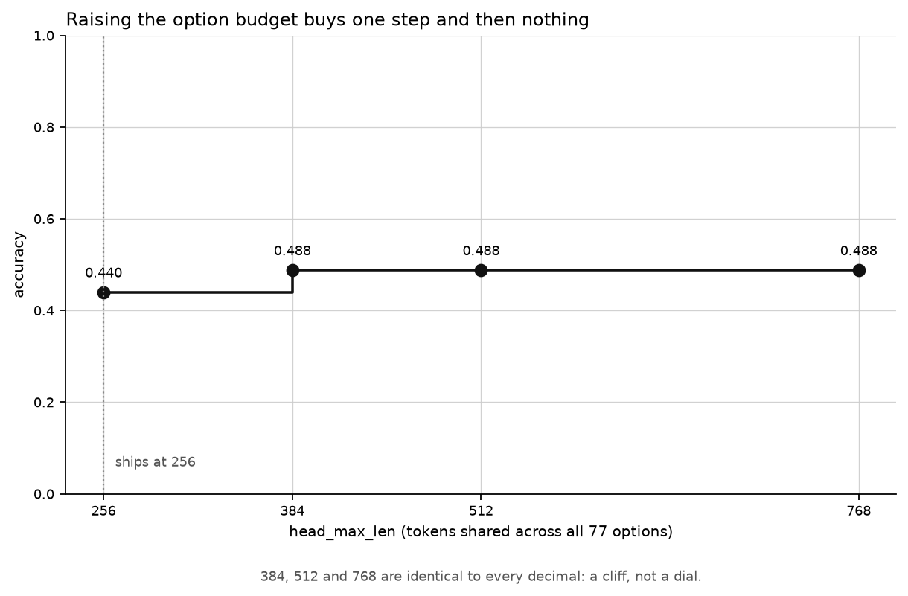
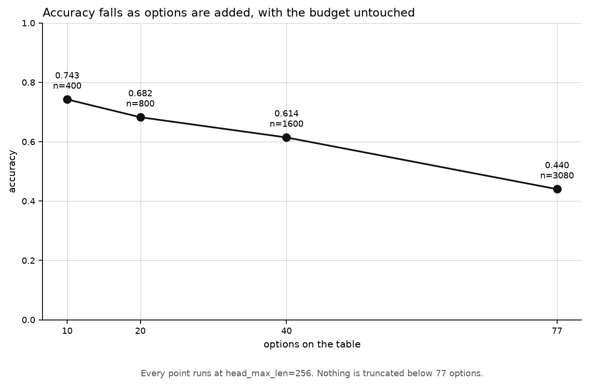
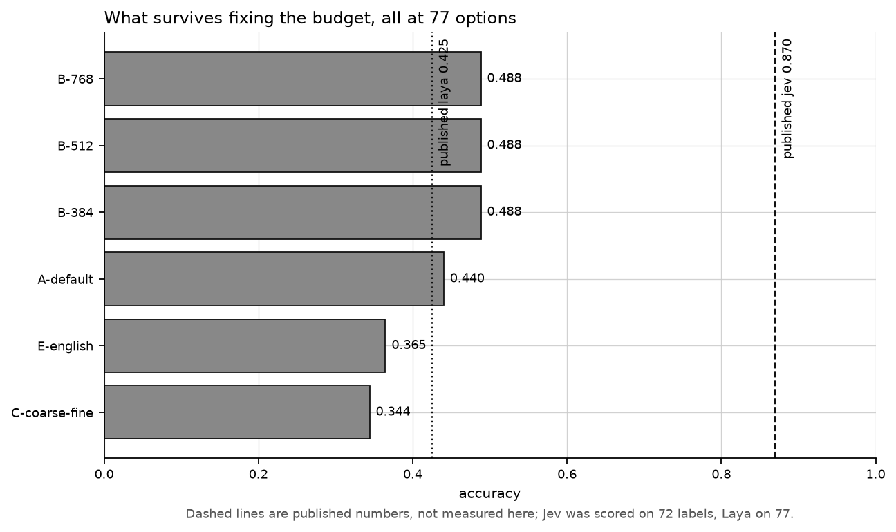

# Results: the token budget is not why Laya fails Banking77

**Status:** `complete`

Protocol: [README.md](README.md). Raw numbers: [`results/full.json`](results/full.json). Every number below was read out of that file, or, where marked, computed directly from the run's wire log.

## The finding

Giving every option all the room it needs removes every truncation collision and buys **4.8 points** — accuracy goes from **0.4403 to 0.4883** on all 3,080 test rows (McNemar p = 2.7e-12) — which still leaves Laya **38.2 points** below the published Jev 0.870, so the option budget is a real but minor part of the failure and most of the failure survives fixing it.

The budget hypothesis, as Convai's model card states it, is **not supported as an explanation**. It is supported as a small effect.

## The numbers

### Every arm, 3,080 test rows unless noted

| arm | n | options | `head_max_len` | accuracy | 95% CI | top-5 | macro-F1 |
|---|---|---|---|---|---|---|---|
| **A-default** | 3,080 | 77 | 256 | **0.4403** | 0.4227 – 0.4575 | 0.6695 | 0.4097 |
| **B-384** | 3,080 | 77 | 384 | **0.4883** | 0.4705 – 0.5052 | 0.7383 | 0.4728 |
| **B-512** | 3,080 | 77 | 512 | **0.4883** | 0.4705 – 0.5052 | 0.7383 | 0.4728 |
| **B-768** | 3,080 | 77 | 768 | **0.4883** | 0.4705 – 0.5052 | 0.7383 | 0.4728 |
| K-10 | 400 | 10 | 256 | 0.7425 | 0.6975 – 0.7850 | 0.9050 | 0.7043 |
| K-20 | 800 | 20 | 256 | 0.6825 | 0.6500 – 0.7150 | 0.8900 | 0.6633 |
| K-40 | 1,600 | 40 | 256 | 0.6144 | 0.5919 – 0.6381 | 0.8181 | 0.5991 |
| C-coarse-fine | 3,080 | 11 then ≤7 | 256 | 0.3442 | 0.3276 – 0.3607 | 0.4747 | 0.3257 |
| E-english | 3,080 | 77 | 192 | 0.3646 | 0.3477 – 0.3808 | 0.6370 | 0.3514 |

**Arm A reproduces the published number.** Convai publishes 0.425 for Laya on Banking77; arm A measures 0.4403 with a 95% interval of 0.4227 to 0.4575, which contains it. The instrument is measuring the thing the card measured.

### The budget sweep is a cliff, not a dial

384, 512 and 768 agree to every decimal place the report carries — accuracy, top-5, macro-F1, ECE, fitted temperature, and the same 151/299 McNemar split against arm A. The diagnostics say why: all three build a 352-token sequence with nothing truncated, so the three arms sent the model the same request and got the same answers back. Raising the budget past 384 buys nothing because there is nothing left to buy.

Their latencies differ (p50 420.1, 439.4, 442.4 ms) even though their answers are identical, so that spread is machine noise, not an effect of the budget.



*One step up at 384 and a flat line after it. Drawn as steps rather than a line on purpose: three equal points joined by a slope would invite the reader to extrapolate a trend that does not exist.*

### Accuracy tracks the number of options, with the budget held still

| arm | options | mean text tokens per option | options truncated | identical pairs | accuracy |
|---|---|---|---|---|---|
| K-10 | 10 | 3.00 | 0% | 0 | 0.7425 |
| K-20 | 20 | 3.20 | 0% | 0 | 0.6825 |
| K-40 | 40 | 3.25 | 0% | 0 | 0.6144 |
| A-default | 77 | 2.74 | 35.1% | 5 | 0.4403 |

At 10, 20 and 40 options the budget mechanism is entirely absent — nothing truncates, nothing collides, and the room each option gets barely moves (3.00 to 3.25 tokens). Accuracy still falls by 12.8 points from 10 to 40 options. Whatever is degrading Laya as the label set widens is doing it while the budget is untouched.

This is the reading the protocol named as falsifying, arrived at from the other direction: the B arms *did* move accuracy, so the stated falsification condition was not met, but the K arms move it far more without the budget changing at all.



*A steady fall from 0.743 to 0.440 with `head_max_len` pinned at 256 the whole way. If the budget were the explanation this line would be flat until truncation starts at 77, and it is not.*

### Where the 4.8 points actually land

*Computed from `runs/full/decisions.jsonl`; not in `results/full.json`, see "What this does not answer".*

At the default budget 7 of the 77 options truncate onto 3 shared strings, and BANKING77's test split is exactly 40 rows per label, so **280 of 3,080 rows (9.1%) carry a gold label the model cannot name.** Splitting the paired A→B-384 comparison on that boundary:

| rows | n | A-default | B-384 | answers gained | of the +4.81 total points |
|---|---|---|---|---|---|
| gold label collides at 256 | 280 | 0.1536 | 0.3143 | +45 | **+1.46** |
| gold label does not collide | 2,800 | 0.4689 | 0.5057 | +103 | **+3.34** |

Less than a third of the gain comes from the rows the collision mechanism can explain. The rest comes from the 2,800 rows that never collided — 27 of 77 options are truncated at 256 without becoming identical to another, and giving those their full text is worth more than un-collapsing the 7. The mechanism the card names, `identical_pairs`, is not even the main channel of the effect it predicts.

And on the 280 collided rows, only **40** of arm A's 237 errors land on the collision partner. The model is mostly wrong in some other direction there too.

### Truncation diagnostics

Read off the sequence `laya.common.build_sequence` itself builds.

| configuration | mean text tokens per option | options truncated | options that collapse onto another | identical pairs |
|---|---|---|---|---|
| 256, 77 options (arm A) | 2.74 | 35.1% (27) | 7 | **5** |
| 384 / 512 / 768, 77 options | 3.32 | 0% | 0 | 0 |
| 192, 77 options (arm E) | 2.75 | 39.0% (30) | 7 | **5** |
| 256, 11 coarse options (arm C, step 1) | 5.00 | 0% | 0 | 0 |
| 256, 7 fine options (arm C, worst group) | 2.71 | 0% | 0 | 0 |

The five pairs the model cannot possibly separate at the default budget:

```
" balance not updated"  <-  balance not updated after bank transfer
                            balance not updated after cheque or cash deposit
" lost or stolen"       <-  lost or stolen card
                            lost or stolen phone
" top up by"            <-  top up by bank transfer charge
                            top up by card charge
                            top up by cash or cheque
```

### The documented workaround is worse than doing nothing

**C-coarse-fine scores 0.3442, which is 9.6 points below arm A** (McNemar p = 1.4e-19, 686 rows arm A gets right and C does not against 390 the other way). The coarse-to-fine arm has **no truncation at either step** — 11 options get 5 tokens each, and the worst fine group gets 2.71 tokens across 7 options with zero collisions. It is the arm with the most room per option of any 77-intent arm, and it is the worst one.

Its top-5 collapses to 0.4747, the lowest of any arm, because a wrong coarse commitment removes the right intent from the candidate set entirely. Arm C reports the fine step's answer rather than the joint argmax, which is the protocol's choice and is what anyone actually deploying the workaround would get.

### The English checkpoint does not reproduce the published number

**E-english scores 0.3646, 7.6 points below arm A** (p = 2.9e-14), with a 95% interval of 0.3477 to 0.3808 that does **not** contain the published 0.425. Both configurations hand 77 options the same four tokens — laya floors the per-option budget at 4, so 192 and 256 are the same room at this option count — and the diagnostics bear that out: 2.75 versus 2.74 mean tokens per option, the same 5 identical pairs, 304 versus 303 sequence tokens.

So the card's internal contradiction resolves against the router. The prose attributes the 0.425 to the 256-token multilingual configuration, and that is the one that reproduces; `Router().predict(...)` on English text would go to the English checkpoint, which measures 0.365 here.

### Paired comparisons

Every comparison below is McNemar over the same 3,080 examples in both arms.

| comparison | accuracy A | accuracy B | B better | A better | p |
|---|---|---|---|---|---|
| A-default vs B-384 | 0.4403 | 0.4883 | 299 | 151 | 2.7e-12 |
| A-default vs B-512 | 0.4403 | 0.4883 | 299 | 151 | 2.7e-12 |
| A-default vs B-768 | 0.4403 | 0.4883 | 299 | 151 | 2.7e-12 |
| A-default vs E-english | 0.4403 | 0.3646 | 354 | 587 | 2.9e-14 |
| A-default vs C-coarse-fine | 0.4403 | 0.3442 | 390 | 686 | 1.4e-19 |

The K arms score different examples from arm A and from each other, so there is no paired test between them and nothing in this table for them. Their intervals must not be read as a ranking against arm A.

### Calibration

| arm | ECE raw, 15 bins | fitted temperature | ECE after temperature |
|---|---|---|---|
| A-default | 0.3097 | 2.279 | 0.1217 |
| B-384 / 512 / 768 | 0.2718 | 2.063 | 0.1318 |
| K-10 | 0.1512 | 2.012 | 0.1348 |
| K-20 | 0.1748 | 2.012 | 0.1022 |
| K-40 | 0.2150 | 2.168 | 0.1052 |
| C-coarse-fine | 0.1704 | 1.962 | 0.1241 |
| E-english | 0.1667 | 1.648 | 0.1504 |

Every arm wants a temperature above 1.6, and arm A wants 2.28: the model is badly over-confident, which is the card's own documented behaviour. Temperature is fitted on 1,003 validation rows carved out of train (108 / 259 / 516 for the K arms) and never on test. It changes almost no argmax — accuracy after temperature is identical for every arm except K-40 (0.6144 to 0.6150, one row) and C-coarse-fine (0.3442 to 0.3438, one row), where the joint two-step distribution can reorder.

Arm E's raw ECE has to be read with the caveat the protocol gives: the English checkpoint ships pre-sharpened per-option temperatures that laya clamps at runtime.

### Latency

**Every latency here is CPU**, on a machine with no usable GPU. Convai's published 33 ms is a T4 figure and is not comparable to any number in this table.

| arm | p50 ms | p95 ms | p95/p50 |
|---|---|---|---|
| A-default | 380.1 | 453.7 | 1.19 |
| B-384 | 420.1 | 494.5 | 1.18 |
| B-512 | 439.4 | 502.5 | 1.14 |
| B-768 | 442.4 | 499.7 | 1.13 |
| K-10 | 93.1 | 112.6 | 1.21 |
| K-20 | 148.8 | 176.8 | 1.19 |
| K-40 | 241.8 | 271.1 | 1.12 |
| C-coarse-fine | 214.9 | 273.9 | 1.27 |
| E-english | 1,042.8 | 1,469.0 | 1.41 |

Raising the budget from 256 to 384 costs 40 ms at p50 and buys 4.8 points, which is the only trade in this table that is worth taking. The tails are tight everywhere; arm E is both the slowest and the widest.

### Figures

Three, all generated by `banking77/figures.py` from `results/full.json` as part of the report step, so a chart cannot drift from the table beside it. Two are above; the third is the whole picture:



*Every bar is a configuration at the full 77 labels. The best of them, B-768 at 0.488, sits a long way left of the published Jev line at 0.870, and that distance is what the budget does not explain. The K sweep is deliberately absent: a ten-option arm on the same accuracy axis would read as the better model.*

A figure whose arms are missing raises rather than drawing a panel with one bar in it, and `write_all` reports the skip with its reason instead of quietly writing nothing.

## Did the prediction hold?

**Mostly no.** The hypothesis under test was Convai's — that the budget explains the failure — and the measurement does not support it.

- **Held: the three raised-budget arms build a byte-identical request.** The protocol predicted that at 384 nothing truncates, so 384, 512 and 768 cannot differ. They agree on every reported metric and on the exact 151/299 McNemar split. All three were run rather than asserted equal.
- **Held: `identical_pairs` is non-zero at the published configuration, and it costs real accuracy.** Five pairs collapse, 280 of 3,080 rows carry a gold label that is unnameable, and arm A scores 0.1536 on them against 0.4689 elsewhere. The mechanism is real.
- **Held, narrowly: room moves accuracy.** The protocol's falsification condition was "the B arms fail to move accuracy above arm A's interval". B-384's 0.4883 is above arm A's upper bound of 0.4575, so the condition was not met and the hypothesis is not falsified on its own stated terms.
- **Did not hold: room does not recover the accuracy.** 4.8 points of a 43.0-point deficit against the published Jev 0.870 — about a ninth of it — leaving 38.2 points on the table with every option fully spelled out. The hypothesis survives as a mechanism and fails as an explanation.
- **Did not hold: `identical_pairs` is the wrong thing to have counted.** The protocol called it "the budget hypothesis stated as evidence rather than as a claim". Only 1.46 of the 4.81 points come from the rows it governs; 3.34 come from options that truncate without colliding. The right count would have been the 27 truncated options, not the 5 identical pairs.
- **Did not hold: the documented workaround is not a workaround.** Arm C exists to ask whether coarse-to-fine beats raising the budget. It loses to raising the budget by 14.4 points and loses to changing nothing at all by 9.6.
- **Did not hold: the option-count arms behave as the falsifying reading describes.** Accuracy falls monotonically from 0.7425 to 0.6144 across 10, 20 and 40 options with zero truncation and near-constant tokens per option, which is accuracy tracking task difficulty rather than tokens. The protocol described that pattern as the one that would mean the budget is not the explanation.

**On when the prediction was written**, see Provenance. It demonstrably predates this run.

## What surprised us

- **Un-collapsing the identical labels is the smaller half of the budget effect.** The whole hypothesis is built on labels that truncate to the same string, and the rows those labels govern contribute 1.46 of the 4.81 points. Ordinary truncation of options that stay distinct contributes more than twice as much. The mechanism everyone can see is not the mechanism doing most of the work.
- **Even on the collided rows, the collision is mostly not what goes wrong.** 237 of the 280 are errors at the default budget, and only 40 of those land on the label the gold collides with. The model is confused about them for reasons other than the truncation, and raising the budget only takes them to 0.3143 — still below the clean rows' 0.4689 at the *unraised* budget.
- **The coarse-to-fine workaround, which has no truncation anywhere, is the worst 77-intent arm.** Its top-5 of 0.4747 is the tell: a wrong coarse commitment deletes the right answer from the candidate set, and the second step then cannot recover. Giving Laya an easier question twice is worse than giving it the hard question once.
- **The English checkpoint's interval excludes the published 0.425.** The card presents 192 and 256 as different budgets; at 77 options laya's `max(4, ...)` floor makes them the same budget, so the 7.6-point gap between arms A and E is checkpoint, not room.
- **The library version moved between the pilot and this run**, laya 0.3.7 to 0.3.20, which the protocol's audit section does not cover. The `per = max(4, (head_max_len - 16) // n_options)` floor the protocol relies on is still present verbatim in the installed 0.3.20, so the mechanism claim survives, but the audit itself was done against a version this run did not use.

## What this does not answer

- **What the other 38 points are.** This experiment is inference-only. It can say the budget is not the explanation; it cannot say whether the remainder is training data, model capacity, the masked-scoring head, or something else. Nothing here isolates a cause, and "a training problem" is a hypothesis this run leaves standing, not one it establishes.
- **Whether a wider label set is hard for Laya specifically or hard in general.** The K arms change the number of options and the chance baseline together — 1/10 against 1/77 — so the fall from 0.7425 to 0.4403 mixes a genuine capability limit with the task simply getting harder. No arm holds task difficulty fixed while varying the option count, and no baseline shares the K arms' examples.
- **Anything about Jev.** It is not measured here. The 0.870 is published, was scored on 72 labels against Laya's 77, and is not the same task; every comparison against it in this file is a comparison to a published figure, not a measurement.
- **Anything above 768 tokens of budget, or with option descriptions.** The options are the bare intent labels with underscores replaced by spaces. Hand-written descriptions would make truncation worse and were deliberately not used, so nothing here says what better option text would do.
- **Anything on a GPU, or any latency comparable to the card's 33 ms.** Every call in this directory ran on CPU.
- **The per-label breakdown, from the committed results.** The collided-versus-clean split above was computed from `runs/full/decisions.jsonl`, which is gitignored. `results/full.json` carries the collisions but not the accuracy on the rows they affect, so a reader cannot re-derive that table without re-running the sweep. `report.py` should emit it.
- **How much of any of this is the 9.1% of rows that cannot move.** Arm A's headline 0.4403 includes 280 rows whose gold label is unnameable at that budget; without them it is 0.4689. Both figures are above, and the headline is the one comparable to the published number.

## Provenance

| | |
|---|---|
| Model | `convaiinnovations/laya`, multilingual subfolder (responds as `laya-rl-agent`); arm E uses the repo-root English checkpoint. Weights at `C:\projects\jev_demo\arena\models\laya` |
| Dataset | BANKING77 from `PolyAI-LDN/task-specific-datasets`, `banking_data/{train,test}.csv`. 3,080 test rows, exactly 40 per label across all 77; 1,003 validation rows held out of train |
| Seeds | 20260924 for the shared shuffle and the stratified split; `val_frac` 0.1; 20 warm-up calls per arm, not recorded |
| Library versions | laya **0.3.20**, torch 2.14.0+cpu, transformers 5.17.0, Python 3.12.14 (the pilot ran laya 0.3.7) |
| Hardware | Intel64 Family 6 Model 186 Stepping 2 (GenuineIntel), AMD64, Windows-11-10.0.26200-SP0, `cuda_available: false`, CPU throughout |
| Run | started 2026-09-25 08:00:16, finished 2026-09-25 11:41:43 — 3h 41m wall clock against the pilot's ~3.2h projection. **28,181 records** in `runs/full/decisions.jsonl` (199 MB, gitignored), one per (arm, example), each holding the exact request, the exact response and the full distribution |
| Results file | `results/full.json`, committed in `a5bdaa7` (2026-09-25 11:55:25). Re-running `report.py` over the wire log rebuilds it **byte-identically** (14,130 bytes, verified this session) |
| Diagnostics | `runs/full/diagnostics/*.json`, one per arm |

**Does the prediction predate the run?** Yes, and `git log --format='%h %ad %s' --date=iso -- banking77/README.md` shows it:

```
e22173b 2026-09-24 20:02:56 -0500 Split every experiment into a protocol and a results file
47eae3b 2026-09-24 11:56:47 -0500 Add the Banking77 token-budget experiment as a sibling
```

README.md has not been touched since `e22173b` (`git diff e22173b -- banking77/README.md` is empty), and the "What we expect" section — including the falsification condition this file is judged against — was written in that commit, **2026-09-24 20:02:56**. The full run started **2026-09-25 08:00:16** and finished at 11:41:43. The prediction is about twelve hours older than the first call of this sweep, and nothing in it was edited afterwards.

Two limits on that, stated plainly. The section does **not** predate the pilot: `47eae3b` landed the harness and the pilot's results together, five minutes after the pilot's `config.json` was stamped, and it contained no "What we expect" heading at all — the section was composed the following evening, quoting docstrings that were already committed. And the protocol's own audit of laya's internals was done against 0.3.7, while this run used 0.3.20; the `max(4, ...)` floor it depends on was re-checked against the installed 0.3.20 for this write-up and is unchanged.

**One thing this file cannot fix.** `README.md` still carries `**Status:** piloted`. The run is complete and the protocol file needs that one word changed, but the protocol is not edited from here.
