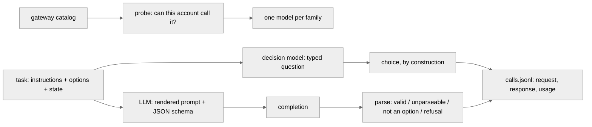

# What does one typed decision cost?

A decision model answers a typed question in one forward pass and hands back a probability
per option. An LLM answers by generating text that has to be parsed back into a decision.
This experiment measures what each approach actually costs for **the same decision**: time,
tokens, money, and whether the answer is usable at all.

Everything hosted goes through the **Vercel AI Gateway**. Laya runs locally on this
machine's CPU and is grouped separately in every table, because that number is not
comparable to a hosted call.

> **Status: the pilot has run, the full experiment has not.** The pilot is 10 examples per
> model on the 5-option task — enough to confirm the transport for each family, measure
> tokens and latency, and project the cost of the full run. See [The pilot](#the-pilot).

## The design decision that matters

**Options are free for a decision model and expensive for an LLM.** Laya and Jev score every
option at its own marker inside one sequence; an LLM must carry every option string in its
prompt on every single call. So the same models answer the same kind of question over two
tasks with very different option counts:

| task | options | where it comes from | ground truth |
| --- | --- | --- | --- |
| `highway` | 5 | the arena's recorded highway-env episodes (`arena/runs/highway/jev/seed-*.json`) — the states and the question, word for word including all five option descriptions | **none.** The game ships only `idle` and `random` baselines, no reference policy, so the report gives model-to-model **agreement**, not accuracy |
| `banking77` | 77 | the existing [`banking77/`](../banking77/README.md) harness — its loader, its frozen option texts and its seeded shuffle are imported, not reimplemented, so the examples are the same rows in the same order | the benchmark label |

Same examples for every model within a task, one fixed seed, shared permutation.

## How it works



- **`catalog.py`** — no model id is written down anywhere in this experiment. The gateway is
  asked what it hosts, the catalog is filtered (language models that expose structured
  outputs and accept a temperature, minus `-fast` / `-pro` / `codex` / image variants) and
  ranked **cheapest first**, then the ranked candidates are **probed with one tiny call**
  until one answers. That last step is not optional: the catalog lists 390 models and this
  account is entitled to a fraction of them.
- **`prompts.py`** — the one place the experiment could cheat, so it is mechanical. The
  instruction line goes in verbatim; every option key and description goes in verbatim and in
  order; an option with no description renders as the bare key, which is exactly how laya
  renders it. The only thing added is one shared `ANSWER_DIRECTIVE`. That is the transport,
  and it is identical for every LLM.
- **`gateway.py`** — the wire. Chat completions for the LLMs, the v4 evaluation-model route
  for Jev. Rate limits and 5xx are retried with exponential backoff **outside the timer**:
  `latency_ms` covers only the attempt that succeeded, `wall_ms` covers the whole call
  including backoff, so queueing is never charged to a model's speed and never disappears.
- **`parse.py`** — validity, as a first-class result. The answer is the `choice` field of a
  JSON object, spelled exactly as the option is spelled. No fuzzy matching, no repair, no
  second call.
- **`laya_local.py`** — Laya from the weights on disk (`LAYA_PATH` honoured), on CPU.
- **`store.py`** — append-and-flush JSONL, keyed by (model, task, example), which doubles as
  the resume point.
- **`run.py`** / **`report.py`** — the task and the CLI, and the tables.

## The fairness rules

These decide whether the result is worth publishing.

1. **The LLMs get their best shot.** Every LLM call uses the gateway's structured-output mode
   — `response_format` with a `json_schema` whose `choice` property is a strict `enum` of the
   option keys. A family whose only reachable model cannot do that would run in a strict-prompt
   arm instead, and `config.json` records which arm each model ran in, because it changes both
   latency and validity.
2. **Identical semantics.** The instruction text and the option list are the same words for
   every model, including Laya and Jev. Only the transport differs.
3. **Temperature 0**, recorded per model; `null` for a model that does not accept one (the
   newer GPT-5 and Claude tiers reject it), never silently assumed.
4. **No retry-until-valid.** One call, one answer. Transport errors (429, 5xx) are retried
   because none of them is an answer; an unparseable *answer* is a result. A repaired answer
   is a different product with a different latency, and repairing quietly is how benchmarks
   lie.
5. **Cost comes off the gateway's own per-call `marketCost`.** Never tokens times a rate from a
   pricing page. The only place a price list is used is the pre-run spend estimate, and it is
   labelled as an estimate.
6. **The option-token overhead is measured, not counted.** For each model and task, the same
   prompt is sent twice — once with the option block, once without — and the provider's own
   reported prompt tokens are differenced.

## The pilot

`--models all --tasks highway --limit 10 --tag pilot`, 20 warm-up calls per model, seed 0.
Ten examples is not a result about which model drives better — it is a check that the
transport works for each family, and a measurement of what a call costs.

### Which models this account can actually call

The gateway lists 390 models. This key is on the **free tier**, which refuses the newer
tiers outright, so the cheapest-first ladder walked past them:

| family | resolved to | refused first |
| --- | --- | --- |
| GPT | `openai/gpt-4.1-nano` | `openai/gpt-6-luna` (403, free tier) |
| Claude | `anthropic/claude-3-haiku` | — (it is the cheapest, and the *only* reachable Claude: `claude-haiku-4.5` is 403) |
| Gemini | `google/gemini-2.5-flash-lite` | — (`gemini-3.1-flash-lite` is 403) |
| Gemma | `google/gemma-4-26b-a4b-it` | `google/gemma-4-31b-it` (403, free tier) |
| Jev | `typesafe-ai/jev` | — |
| Laya | local weights, CPU | — |

All four LLM families ran in **structured mode** (`json_schema`, strict, `enum` of the option
keys) at **temperature 0**. Jev and Laya answer a typed question, so there is no arm to choose.

### Per model, 10 examples, 5 options

Hosted, via the gateway:

| model | id | p50 ms | p95 ms | wall p50 | in tok | out tok | $/1k decisions | valid | retries |
| --- | --- | ---: | ---: | ---: | ---: | ---: | ---: | ---: | ---: |
| Jev | `typesafe-ai/jev` | **252** | **308** | 252 | 487 | 61 | 0.0204 | 100% | 0 |
| Gemini | `google/gemini-2.5-flash-lite` | 689 | 7093 | 689 | 195 | 8.1 | 0.0205 | 90% | 9 |
| Claude | `anthropic/claude-3-haiku` | 723 | 1067 | 854 | 637 | 39.0 | 0.1873 | 90% | 18 |
| GPT | `openai/gpt-4.1-nano` | 924 | 1245 | 4190 | 212 | 7.4 | 0.0242 | 100% | 20 |
| Gemma | `google/gemma-4-26b-a4b-it` | 951 | 2450 | 980 | 197 | 8.0 | 0.0303 | 100% | 7 |

Local, CPU, **not comparable to the rows above** — no network in it, and no GPU on this
machine:

| model | p50 ms | p95 ms | in tok | out tok | $/1k | valid |
| --- | ---: | ---: | ---: | ---: | ---: | ---: |
| Laya | 368 | 473 | not reported | not reported | 0.0000 | 100% |

**The two clocks are the point of the table.** GPT's median *successful attempt* took 924 ms;
its median call took 4,190 ms, because the free tier rate-limited it on 6 of 10 calls. Neither
number alone is honest, so both are reported.

**Nothing failed to parse.** Every validity failure in the pilot — one Claude call, one
Gemini call — was a 429 that survived five retries, recorded as `api_error`. In structured
mode, on a 5-option list, all four LLMs returned a legal option every time they returned
anything at all. The parsing tax the experiment was built to catch did not show up here; it is
the 77-option task, where the enum is long, that should test it.

### What the option list costs

Measured, not counted: the same prompt twice, with and without the option block (and with the
`enum` taken out of the schema but the schema left in, so that structured-output scaffolding is
not charged to the options), differencing the provider's own reported prompt tokens.

| model | 5 options | share of prompt | 77 options | share of prompt |
| --- | ---: | ---: | ---: | ---: |
| `openai/gpt-4.1-nano` | 69 of 212 | 33% | 692 of 757 | **91%** |
| `anthropic/claude-3-haiku` | 84 of 637 | 13% | 785 of 1246 | 63% |
| `google/gemini-2.5-flash-lite` | 69 of 203 | 34% | 610 of 653 | **93%** |
| `google/gemma-4-26b-a4b-it` | 55 of 198 | 28% | 345 of 397 | 87% |
| Jev (whole request) | 487 total | — | 943 total | — |
| Laya | reports no tokens | — | reports no tokens | — |

At 77 options, **nine tenths of what an LLM is billed for on every single call is the option
list** — the same 77 strings, re-sent for every customer message. That is the structural point
of the experiment.

It is not the whole story, and the surprise is on the other side: **Jev's own input tokens also
roughly double**, 487 → 943, going from 5 options to 77. Options are not free for a decision
model either; they are just an order of magnitude cheaper per token. On the 5-option task Jev
and the cheapest LLM cost the *same* per decision ($0.0204 vs $0.0205 per thousand). The gap
only opens at 77 options, and it is about 1.6×, not 10×.

### Caveats that the full run should not inherit

- **Free-tier model tiers.** `claude-3-haiku` is a 2024 model and is the only Claude this key
  can reach; the GPT, Gemini and Gemma arms are also a generation or two behind what the
  catalog lists. Topping up the gateway would change both the quality and the latency numbers,
  and `--models gpt=<id>` exists for exactly that.
- **Free-tier rate limits.** 54 retries across 50 hosted calls. That is what makes wall clock
  5–30× the successful-attempt latency, and it is an artifact of the account, not the models.
- **Agreement is not quality.** With no reference policy, the report gives pairwise agreement —
  and Gemma agreed with Jev on 10 of 10 only because Gemma answered `IDLE` every time. The
  arena's `idle` baseline exists precisely because a constant is not a driver.

### What the full run would cost

Projected from the measured per-call costs above, both tasks, all six arms:

| examples per model per task | highway | banking77 | total | worst-case 95% CI half-width |
| ---: | ---: | ---: | ---: | ---: |
| 200 | $0.06 | $0.13 | $0.20 | ±6.9 pp |
| **300** | **$0.09** | **$0.20** | **$0.29** | **±5.7 pp** |
| 500 | $0.15 | $0.32 | $0.46 | ±4.4 pp |
| 1000 | $0.29 | $0.62 | $0.91 | ±3.1 pp |

**300 is the recommendation.** It buys a ±5.7 pp interval on BANKING77 accuracy — enough to
separate models that differ by more than about 12 points, which is the size of the gaps this
comparison is looking for — and roughly 300 timed calls per model, which is enough for a p95
that is not one unlucky request. It is not enough to split two models that land within a few
points of each other; that needs 1000, and 1000 costs about $0.91, still under the $1 guard.

Money is not the binding constraint. **Wall clock is**: at the pilot's observed rates the six
arms together take ~25 s per example on the 5-option task, almost all of it 429 backoff, so 300
examples across both tasks is on the order of **5–6 hours serial**. Paid credits would cut that
several-fold and unlock current models at the same time.

## Running it

```bash
# the pilot: 10 examples per model, 5-option task only
python -m latency.run --models all --tasks highway --limit 10 --tag pilot
python -m latency.report --tag pilot

# one arm, pinned to an exact model id (once the account can reach a better one)
python -m latency.run --models gpt=openai/gpt-5.4-mini --tasks highway --limit 50 --tag full
```

| flag | what it does |
| --- | --- |
| `--models` | `all`, or a comma-separated subset of `gpt,claude,gemini,gemma,jev,laya`; `name=model-id` pins one arm to an exact id |
| `--tasks` | `highway`, `banking77`, or both |
| `--limit` | first N examples per task (0 = all) |
| `--warmup` | warm-up calls per model per task, not recorded (default 20) |
| `--threshold` / `--yes-spend` | **cost guard.** Before any measured call, the run prices itself from the option-overhead probe's *measured* tokens and the catalog's price, prints the per-arm breakdown, and refuses to spend more than `--threshold` (default $1.00) without `--yes-spend` |
| `--probe-only` | measure the option-token overhead and print the price of the run, then stop |

The run is **resumable**: every (model, task, example) already in `calls.jsonl` is skipped, so
a killed run is restarted with the same command. Warm-ups are drawn from outside the measured
window where there are examples to spare, so provider-side prompt caching cannot make a
measured call look cheaper than a cold one.

## Every call is on the wire

One line per (model, task, example) in `latency/runs/<tag>/calls.jsonl`, holding the exact
request, the exact response and the provider's own usage block — plus latency on both clocks,
the validity verdict and its detail, retries, and the gateway's per-call cost. `config.json`
records every resolved model id, the gateway's version block for it, which arm it ran in, its
temperature, the option-overhead measurement, the seed and the library versions.

## Tests

```bash
python -m pytest latency/tests -q
```

The pure logic is test-driven: catalog ranking and family resolution, prompt rendering,
validity classification, percentiles and the bootstrap CI, agreement, the spend estimate, the
store's resume key, both task loaders, and the transport's retry behaviour against a fake HTTP
post — including that the backoff never lands in the reported latency and that an answer is
never asked for twice.
