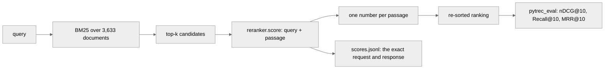

# Can a decision model re-rank retrieval better than BM25?

**Status:** `complete`

Results: [RESULTS.md](RESULTS.md). This file is the protocol.

## The question

Does putting a decision model in front of a retrieval ranking make the ranking better, and what does it cost?

## Motivation

A decision model does not write text. You hand it the situation in words and the options you will accept, and it hands back a number for every option: a probability, or a position on a scale you defined. There is nothing to parse, and it cannot answer with something that is not on the list.

Two of them are measured here. **[Jev](https://typesafe.ai/blog/introducing-system-one-models-and-jev)** is TypeSafe AI's hosted System One model, closed weights, reached over HTTP. **[Laya](https://github.com/NandhaKishorM/laya)** is Convai's open-weights alternative, 421M parameters, downloaded and run on your own machine. Both answer the same typed questions, so the same request can be sent to either.

Re-ranking is a real stage in a real pipeline, and today it is served either by a cross-encoder or by a language model call per passage. If a decision model can judge relevance in tens of milliseconds it is cheaper to operate than a cross-encoder and far cheaper than a language model call per candidate, which is the case worth testing.

**Nothing is trained here.** This is deliberately zero-shot: the numbers are the baseline that makes a later fine-tune interpretable. Laya's own model card is blunt that its base checkpoints are near chance on typed decisions zero-shot, so a low number for Laya is expected information, not a bug.

What changes depending on the answer: if a decision model beats BM25, re-ranking is a place to put one, and the cost per thousand calls decides whether it beats the cross-encoder in production. If it does not, the open-weights case needs a fine-tune before it is worth anything here at all.

## What we expect

**Reconstructed after the fact, and labelled as such. This section is not evidence.**

This experiment ran before the two-file structure existed, and no prediction was written down anywhere before the run. What follows is a reconstruction written on 2026-09-24, after the result was known, and a reconstruction proves nothing about what anyone believed beforehand. It is here so the section is not silently empty, and it must not be read as a prediction that was tested.

The reconstruction: Laya was expected to re-rank well, and better than Jev, because Convai's published benchmarks put it ahead of Jev on text relevance tasks and this task is text relevance. What would have falsified it: either Laya's paired nDCG@10 difference against BM25 failing to clear zero upwards, or Jev's exceeding Laya's.

What `git log` shows, for anyone checking whether some earlier record exists. The only written statement of a prediction anywhere in this repository is the "What we expected, written down first" block in `site/app/rerank/page.tsx`. That file first appears in commit `aed6b19` (2026-09-23T20:04:24-05:00) and its current wording in `95a7f62` (2026-09-24T10:35:09-05:00). The full run finished at `2026-09-24T00:16:10+00:00`, which is 2026-09-23T19:16 local, about 48 minutes before the page was first committed. So the site's prediction block postdates the run it claims to precede, and cannot serve as evidence either. The page's own claim that the prediction was written down first is not supported by the repository history.

## Data

BEIR NFCorpus, the official **test** split: **3,633 documents and 323 test queries**, with the official qrels.

Fetched from the Hugging Face mirror of BEIR's own files by `rerank/data.py`: `BeIR/nfcorpus` for the corpus and queries (parquet), `BeIR/nfcorpus-qrels` for the official `test.tsv`. The same bytes BEIR publishes, so the numbers are comparable to published work. Not the `beir` package: it pulls sentence-transformers, elasticsearch and a torch stack in just to unzip a dataset, and it fetches a zip from a university host that is regularly down. `ir_datasets` would have worked too; `hf_hub_download` gets the identical official files with one small dependency, a cache and a resumable download. The dataset lands in the Hugging Face cache, or in `--cache-dir`.

NFCorpus qrels grade 0, 1 or 2; the metrics treat anything above 0 as relevant. Passages are cut to the first 1,000 characters before scoring, the same cut for every method.

**Licence:** not recorded in this repository, and this protocol does not establish it. The files come from the BEIR mirrors named above and carry whatever those repositories carry.

## Method

BM25 retrieves a fixed set of candidate passages per query. Each candidate is then handed to a model as **one typed question**, query and passage in, one number out, and the candidates are re-sorted by that number.



**What varies:** the scorer, and nothing else.

| Arm | What it is |
|---|---|
| `bm25` | the floor. The candidate order BM25 itself returned |
| `jev-score` | Jev over HTTP, the `score` question |
| `cross-encoder` | `cross-encoder/ms-marco-MiniLM-L-6-v2`, locally |
| `laya-score` | Laya's base English checkpoint, the `score` question |
| `laya-typed-score` | the `typed-decisions` fine-tune, the identical question |

**What is held fixed:** every method re-ranks the **same** candidate list for the same queries, so the comparison is paired per query and BM25 itself is the floor rather than a rival. The same instructions and the same state go to Jev and to Laya, word for word. The same 1,000-character passage cut applies to Laya and to the cross-encoder. Ties keep the candidate order, so "no opinion" means "no change" rather than "shuffle". No prompt is tuned against the test split, which would make the number meaningless.

**Seeds:** none. BM25 candidate generation, the cross-encoder and both Laya checkpoints are deterministic here, and no seed is recorded in the results files. Jev is a hosted service and is not under this protocol's control.

### The two question formulations

Nobody has published which typed question ranks better, and the second pass costs one more sweep, so both were run on identical data in the pilot.

| Name | Type | What it takes | What it returns |
|---|---|---|---|
| `laya-score` | `score` | an ordered list of five rungs, "irrelevant" to "directly answers the query" | the expected position on that scale, 0 to 4 |
| `laya-noul` | `noul` | no criteria at all | one probability that the passage answers the query |

Both are in `rerank/rerankers/laya.py`. `laya-typed-score` and `laya-typed-noul` ask the identical questions of the `typed-decisions` fine-tune instead of the base English checkpoint; the checkpoint is the only thing that differs. All four read one weights folder, `models/laya`, downloaded on first use, or wherever `LAYA_PATH` points.

`rerank/rerankers/jev.py` asks Jev the same two questions over HTTP. Only the dialect is translated: Jev's v4 schema calls the criteria-free question `boolean` and answers it with `probability` rather than `noul`, so `jev-noul` sends `"type": "boolean"` and reads `probability`. The instructions and the state are word for word what Laya is handed, so the two models are asked the identical thing.

### The instrument

- **`rerank/data.py`** loads the corpus, the queries and the qrels.
- **`rerank/bm25.py`** builds the candidates. The order it returns is both the BM25 ranking and the tie-break every other method falls back to.
- **`rerank/rerankers/`** has one module per model, all with the same interface, `score(query, passage) -> {score, request, response, latency_ms}`. `make_reranker(name)` in `__init__.py` is the only place a reranker is chosen by name, so adding Jev is a new module and one line and the task does not change.
- **`rerank/rank.py`** turns scores into a ranking.
- **`rerank/metrics.py`** wraps `pytrec_eval` (the trec_eval C code). trec_eval has no MRR@10, so the run is cut to the top 10 before `recip_rank` is asked for. `mean_ci` is a plain t interval written out rather than pulled from scipy, which would be a large dependency for twenty lines.
- **`rerank/store.py`** is the append-and-flush JSONL log, which doubles as the resume point.
- **`rerank/evaluate.py`** is the task and the CLI.

### Every decision is on the wire

A re-ranker that emits only a score is not good enough here. Every (query, passage) pair scored appends one line to `runs/<tag>/scores.jsonl` holding the exact request sent and the exact response received:

```json
{
  "method": "laya-noul",
  "query_id": "PLAIN-102",
  "doc_id": "MED-3253",
  "score": 0.1733,
  "latency_ms": 621.51,
  "request": {
    "state": {
      "query": "Stopping Heart Disease in Childhood",
      "passage": "Pathobiological determinants of atherosclerosis in youth risk scores..."
    },
    "questions": {
      "relevance": {
        "type": "noul",
        "instructions": "A search engine returned this passage for this query. Does this passage answer the query?"
      }
    }
  },
  "response": {
    "model": "laya-rl-agent",
    "answers": {
      "relevance": {"type": "noul", "noul": 0.1733, "confidence": 0.8267, "action": {"act_probability": 1.0}}
    },
    "usage": {"input_tokens": 233, "output_tokens": 0}
  }
}
```

That file is also why the run is resumable. Rerun the same command after an interruption and only the unscored pairs are sent; the candidate set is pinned in `runs/<tag>/candidates.json` so a resumed run re-ranks exactly the same passages.

## Metrics

- **nDCG@10**, the primary measure. It is the standard BEIR headline number, so the floor and the arms can be read against published work.
- **Recall@10**, because a re-ranker can raise nDCG by reordering the same relevant passages without finding any more of them, and this separates the two.
- **MRR@10**, because a search user reads from the top and the rank of the first relevant passage is what they feel.
- **The paired nDCG@10 difference against BM25, with a 95% t interval.** Every method re-ranks the same candidates for the same queries, so the difference is paired per query. A mean is a result only when the interval around it stays on one side of zero. This is the number the experiment turns on.
- **Latency p50 and p95 per call**, to price the stage, with the hardware caveat below.
- **Cost**, taken from the gateway's own per-call `marketCost`, never tokens times a rate from a pricing page.
- **Call accounting**: retries, failures, and how many scored passages sit in a tie, because a tie is BM25's judgement counted inside a re-ranker's score.

## Assumptions and limits

- **On 91 of the 323 queries, no re-ranker could have changed anything.** BM25 retrieved 20 candidates for every query, and for 91 of them not one of those 20 is judged relevant by the official qrels. nDCG@10 is zero for BM25 and zero for every re-ranker on those queries, whatever order they choose, so they contribute nothing but denominator to every mean. The result is therefore measured on the 232 queries where re-ranking was possible at all, and reported over 323.
- **Laya and the cross-encoder run on CPU. There is no usable GPU on this machine**, so their latencies are CPU latencies and are not comparable to Laya's published 39.5 ms on a T4. Jev runs over the network, so its latency is a round trip and not a comparable quantity at all. Nothing here is a speed claim.
- **Jev is never compared with the cross-encoder.** Each interval is against the common BM25 floor, and two intervals that both exclude zero do not establish that one method beats the other. The paired Jev-minus-cross-encoder difference would, and it is not part of this protocol.
- **The pilot and the full run are not directly comparable**, and where they disagree the full run is the one to believe. The pilot used top-50 candidates and the full run top-20, and a shallower candidate pool is a cleaner one, which moves BM25's own floor with it.
- **A tie is not an opinion.** `rank_by_score` leaves tied passages in the order BM25 gave them, and the gateway rounds Jev's answers to two decimals (`rounding: {"scoreDecimals": 2}` comes back on every call), so a 0-to-4 score has at most 401 places to land. Coarse steps mean ties, and the rounding is not something a client can switch off.
- **Passages are cut to 1,000 characters.** NFCorpus abstracts are longer than the English checkpoint's roughly 320-token state budget, so they are cut where it is visible in the recorded request. Nothing here measures what the tail would have added.
- **A failed call keeps BM25's position.** Nothing is invented for a call that never succeeded, which means those passages are BM25's judgement counted inside the re-ranker's score.
- **The Laya passes and the Jev pass overlap in time.** Jev is network-bound and Laya is CPU-bound so they do not contend, but the Laya latencies are slightly pessimistic and are not strictly comparable to the pilot's. They remain comparable to each other, which is what the base-versus-fine-tune question needs.

## How to run it

Needs [uv](https://docs.astral.sh/uv/) and Python 3.12.

### Laya's weights

Laya needs no key. About 2.3 GB of weights download on first use into `models/laya`, which is not committed. If you already have them, point at that folder instead and nothing is downloaded:

```
export LAYA_PATH=/path/to/laya        # or pass --laya-path
```

If the weights are missing **and** the download fails, the run stops and says both of those things rather than half-loading a model.

### Jev's key

Jev is a hosted API and needs a key. Copy `.env.example` to `.env` in this repo's root:

```
AI_GATEWAY_API_KEY=your_key       # Vercel AI Gateway (typesafe-ai/jev)
TYPESAFE_API_KEY=your_key         # optional: TypeSafe's API directly, preferred when set
```

Either variable also works straight from the environment; `TYPESAFE_API_KEY` wins when both are set, as it pins the model version. The Vercel account needs a credit card on file before AI Gateway will serve requests. Nothing but `jev-*` needs a key: BM25, the cross-encoder and both Laya checkpoints run entirely locally.

### The commands

```
uv sync
uv run python -m rerank.evaluate --limit 30 --top-k 50
```

The full-scale run is:

```
uv run python -m rerank.evaluate --limit 0 --top-k 20 \
    --methods bm25 laya-score laya-typed-score jev-score cross-encoder
```

`--limit 0` runs all 323 test queries. `--top-k` sets candidates per query. `--methods` picks a subset of `bm25`, `laya-score`, `laya-noul`, `laya-typed-score`, `laya-typed-noul`, `jev-score`, `jev-noul`, `cross-encoder`.

Results go to `results/<tag>-<timestamp>.json`; the raw wire log and the candidate set go to `runs/<tag>/` and are not committed. A method whose pairs are all already in the store is summarized from those records without loading the model, so re-running the command after an interruption resumes rather than restarts, and re-running it when everything is done just re-reports.

**Expected wall clock and cost.** The full run is 6,460 scoring calls per re-ranker, 25,840 in total. The scoring wall clock the run recorded was 3,118.0 s for Jev, which is the sum of the attempts that succeeded against about 3 h 40 m of real elapsed time, the difference being retry backoff; 6,312.7 s and 5,986.0 s for the two Laya passes; 296.8 s for the cross-encoder. The Laya passes ran while the Jev pass was in flight. Money is not the constraint: the whole Jev pass cost $0.1533 at the gateway's own per-call price, which is $0.0237 per 1,000 calls. Everything else runs locally and costs nothing.

```
uv run pytest
```

## Protocol amendments

- **2026-09-23**, between the pilot and the full run (dated from the pilot's own result files, `results/test-top50-q30-*.json`, the latest of which is stamped `20260923-140116`, against the full run finishing `2026-09-24T00:16:10+00:00`): the full run carries the `score` formulation only and drops the `noul` and `boolean` variants. The pilot found neither formulation better than the other for either model, and repeating them at 323 queries would have doubled the cost of a question already answered. The full run also moves from top-50 candidates to top-20.
