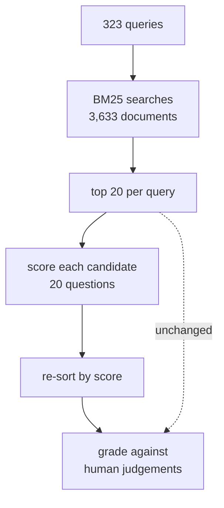

# Can a decision model re-rank retrieval better than BM25?

## The question

Does putting a decision model in front of a retrieval ranking make the ranking better, and what does it cost?

## Motivation

A decision model does not write text. You hand it the situation in words and the options you will accept, and it hands back a number for every option: a probability, or a position on a scale you defined. There is nothing to parse, and it cannot answer with something that is not on the list.

Two of them are measured here. **[Jev](https://typesafe.ai/blog/introducing-system-one-models-and-jev)** is TypeSafe AI's hosted System One model, closed weights, reached over HTTP. **[Laya](https://github.com/NandhaKishorM/laya)** is Convai's open-weights alternative, 421M parameters, downloaded and run on your own machine. Both answer the same typed questions, so the same request can be sent to either.

Re-ranking is a real stage in a real pipeline, and today it is served either by a cross-encoder or by a language model call per passage. If a decision model can judge relevance in tens of milliseconds it is cheaper to operate than a cross-encoder and far cheaper than a language model call per candidate, which is the case worth testing.

**Nothing is trained here.** This is deliberately zero-shot: the numbers are the baseline that makes a later fine-tune interpretable. Laya's own model card is blunt that its base checkpoints are near chance on typed decisions zero-shot, so a low number for Laya is expected information, not a bug.

What changes depending on the answer: if a decision model beats BM25, re-ranking is a place to put one, and the cost per thousand calls decides whether it beats the cross-encoder in production. If it does not, the open-weights case needs a fine-tune before it is worth anything here at all.

## Data

What it holds, with real rows: **[DATASET.md](DATASET.md)**, written by `uv run cli dataset rerank`.

[BEIR](https://github.com/beir-cellar/beir) **[NFCorpus](https://www.cl.uni-heidelberg.de/statnlpgroup/nfcorpus/)**, the official **test** split: **3,633 documents and 323 test queries**, with the official qrels.

| | source |
|---|---|
| corpus and queries | [`BeIR/nfcorpus`](https://huggingface.co/datasets/BeIR/nfcorpus) (parquet) |
| relevance judgements | [`BeIR/nfcorpus-qrels`](https://huggingface.co/datasets/BeIR/nfcorpus-qrels), official `test.tsv` |

`rerank/data.py` fetches these with `hf_hub_download`. They are the same bytes BEIR publishes, so the numbers are comparable to published work. Not the `beir` package: it pulls sentence-transformers, elasticsearch and a torch stack in just to unzip a dataset, and fetches a zip from a university host that is regularly down. The files land in the Hugging Face cache, or in `--cache-dir`.

NFCorpus qrels grade 0, 1 or 2; anything above 0 counts as relevant. Passages are cut to the first 1,000 characters before scoring, the same cut for every method.

**Licence:** not recorded here. The files carry whatever the BEIR repositories above carry.

## Method

Retrieval in two stages. **BM25 retrieves; a re-ranker re-orders what BM25 retrieved.** The second stage cannot add a document or remove one -- it only changes the order of the candidates it is given, which is the constraint the whole experiment sits inside.



### One query, end to end

The 323 queries are health questions; the 3,633 documents are PubMed abstracts. Humans have already marked which documents answer which question.

Take `PLAIN-102`, **"Stopping Heart Disease in Childhood"**. BM25 scores all 3,633 documents on keyword overlap and returns its best 20:

```
rank  doc        relevant?  title
   1  MED-3954   no         Does childhood meat eating contribute to sex differences...
   2  MED-4247   no         Can lifestyle changes reverse coronary heart disease?...
   3  MED-4616   no         Can lifestyle changes reverse coronary heart disease?...
   4  MED-1999   no         Strategies for preventing type 2 diabetes...
   5  MED-3253   YES        Pathobiological determinants of atherosclerosis in youth...
   6  MED-4160   no         Risks and benefits of estrogen plus progestin...
 ...                        (20 in total)
```

One of the 20 is relevant, and BM25 put it fifth. **The experiment is whether a model can move it to first.** Better order, better score; worse order, worse score.

The model cannot see the list. It scores one pair at a time, so it is asked 20 separate questions:

> Question: *Stopping Heart Disease in Childhood*. Passage: *Pathobiological determinants of atherosclerosis in youth...* -- how relevant, 0 to 4?

Twenty questions, twenty numbers, sort by the numbers. That is the only way to get an order out of a model that scores pairs rather than lists.

Then the new order is graded against the human judgements, and BM25's untouched order is graded the same way.

**323 queries x 20 candidates = 6,460 questions per method**, and the exact request and response of every one is kept.

### Why it is built this way

**Every method re-ranks the identical candidate list**, so the comparison is paired per query: subtract BM25's nDCG@10 on a query from a method's on the same query and you have that method's effect on that query. A mean of those differences is a far sharper instrument than two overlapping averages, because the query-to-query variation -- some queries are simply easier -- cancels.

**BM25 is the floor, not a rival.** Its own order is what you get for doing nothing, so the question each method answers is "is this better than not bothering", which is the question that decides whether to run a re-ranker in production at all.

**What varies is the scorer and nothing else.**

| Method | What it is |
|---|---|
| `bm25` | the floor. The candidate order BM25 itself returned |
| `jev-score` | Jev over HTTP, the `score` question |
| `cross-encoder` | `cross-encoder/ms-marco-MiniLM-L-6-v2`, locally |
| `laya-score` | Laya's base English checkpoint, the `score` question |
| `laya-typed-score` | the `typed-decisions` fine-tune, the identical question |

**What is held fixed.** The same instructions and the same state go to Jev and to Laya, word for word. The same 1,000-character passage cut applies to Laya and to the cross-encoder. Ties keep the candidate order, so "no opinion" means "no change" rather than "shuffle". No prompt is tuned against the test split.

**What re-ranking cannot fix.** On **91 of the 323 queries**, none of BM25's 20 candidates is judged relevant at all. Every method scores zero on those whatever order it picks, so they contribute nothing but denominator to every mean. The per-query table carries a `can_move` column for exactly this, and re-ranking was possible on 232 queries.

**Seeds:** none. BM25, the cross-encoder and both Laya checkpoints are deterministic here. Jev is a hosted service and is not under this repository's control.

**Candidates:** top 20 per query. The pilot used 50; a shallower pool is a cleaner one and it moves BM25's own floor with it, so the two are not directly comparable.

### The two question formulations

Nobody has published which typed question ranks better, so both were run on identical data in the pilot. It found neither better than the other for either model, so the full run carries **`score` only**.

| Name | Type | What it takes | What it returns |
|---|---|---|---|
| `laya-score` | `score` | five rungs, "irrelevant" to "directly answers the query" | the expected position on that scale, 0 to 4 |
| `laya-noul` | `noul` | no criteria at all | one probability that the passage answers the query |

Both live in `rerank/rerankers/laya.py`. `laya-typed-score` and `laya-typed-noul` ask the identical questions of the `typed-decisions` fine-tune instead of the base checkpoint; the checkpoint is the only thing that differs. All four read one weights folder, `models/laya`, downloaded on first use or wherever `LAYA_PATH` points.

`rerank/rerankers/jev.py` asks Jev the same two questions over OpenRouter's `systemone` route, with the build pinned to a date. Only the dialect is translated: Jev calls the criteria-free question `boolean` and answers it with `probability` rather than `noul`, so `jev-noul` sends `"type": "boolean"`. The instructions and the state are word for word what Laya is handed.

Jev is the only method that leaves the machine, and the only one needing a key: `OPENROUTER_API_KEY`, read from the environment or this repository's root `.env`. Laya's 2.3 GB of weights download on first use unless `LAYA_PATH` already points at them.

### The code

| File | What it does |
|---|---|
| `data.py` | loads the corpus, the queries and the qrels |
| `bm25.py` | builds the candidates. Its order is both the BM25 ranking and every other method's tie-break |
| `rerankers/` | one module per model, all `score(query, passage) -> {score, request, response, latency_ms}`. `make_reranker(name)` is the only place a model is chosen by name |
| `rank.py` | turns scores into a ranking |
| `metrics.py` | wraps `pytrec_eval` (the trec_eval C code). It has no MRR@10, so the run is cut to the top 10 before `recip_rank` is asked for |
| `store.py` | the append-and-flush JSONL log, which doubles as the resume point |
| `evaluate.py` | the task and the CLI |

## Where the output goes

| Path | What | Committed |
|---|---|---|
| `rerank/results/<tag>-<timestamp>.json` | the summary metrics for every method: nDCG@10, Recall@10, MRR@10, the paired differences and their intervals, latency, cost, call accounting | **yes** |
| `rerank/runs/<tag>/scores.jsonl` | the raw wire log. One line per (query, passage) scored, holding the exact request sent and the exact response received | no, gitignored |
| `rerank/runs/<tag>/candidates.json` | the pinned candidate set, so a resumed run re-ranks exactly the same passages | no, gitignored |

The wire log is why the run is resumable: re-run the same command after an interruption and only the unscored pairs are sent. A method whose pairs are all already in the store is summarised from those records without loading the model, so re-running when everything is done just re-reports.

One line of `scores.jsonl`:

```json
{
  "method": "laya-noul",
  "query_id": "PLAIN-102",
  "doc_id": "MED-3253",
  "score": 0.1733,
  "latency_ms": 621.51,
  "request": {
    "state": {
      "query": "Stopping Heart Disease in Childhood",
      "passage": "Pathobiological determinants of atherosclerosis in youth risk scores..."
    },
    "questions": {
      "relevance": {
        "type": "noul",
        "instructions": "A search engine returned this passage for this query. Does this passage answer the query?"
      }
    }
  },
  "response": {
    "model": "laya-rl-agent",
    "answers": {
      "relevance": {"type": "noul", "noul": 0.1733, "confidence": 0.8267, "action": {"act_probability": 1.0}}
    },
    "usage": {"input_tokens": 233, "output_tokens": 0}
  }
}
```

A re-ranker that emitted only a score would not be enough: without the exchange there is no way to check afterwards what a model was actually asked.

## Metrics

- **nDCG@10**, the primary measure. The standard BEIR headline number, so the floor and the methods can be read against published work.
- **Recall@10**, because a re-ranker can raise nDCG by reordering the same relevant passages without finding any more, and this separates the two.
- **MRR@10**, because a search user reads from the top and the rank of the first relevant passage is what they feel.
- **The paired nDCG@10 difference against BM25, with a 95% t interval.** Every method re-ranks the same candidates for the same queries, so the difference is paired per query. A mean is a result only when the interval stays on one side of zero. This is the number the experiment turns on.
- **Latency p50 and p95 per call**, to price the stage, with the hardware caveat below.
- **Cost**, taken from the provider's own per-call figure, never tokens times a rate from a pricing page.
- **Call accounting**: retries, failures, and how many scored passages sit in a tie, because a tie is BM25's judgement counted inside a re-ranker's score.

## Assumptions and limits

- **On 91 of the 323 queries, no re-ranker could have changed anything.** BM25 retrieved 20 candidates per query, and for 91 of them not one is judged relevant by the official qrels. nDCG@10 is zero for BM25 and zero for every re-ranker on those queries whatever order they choose, so they contribute nothing but denominator. Re-ranking was possible on 232 queries, and the means are reported over all 323.
- **Laya and the cross-encoder run on CPU. There is no usable GPU on this machine**, so their latencies are CPU latencies and are not comparable to Laya's published 39.5 ms on a T4. Jev runs over the network, so its latency is a round trip and not a comparable quantity at all. Nothing here is a speed claim.
- **Jev is never compared with the cross-encoder.** Each interval is against the common BM25 floor, and two intervals that both exclude zero do not establish that one method beats the other. The paired difference would, and it is not measured.
- **The pilot and the full run are not directly comparable**, and where they disagree the full run is the one to believe. The pilot used top-50 candidates and the full run top-20, and a shallower pool is a cleaner one, which moves BM25's own floor with it.
- **A tie is not an opinion.** `rank_by_score` leaves tied passages in the order BM25 gave them, and Jev's answers come back rounded to two decimals, so a 0-to-4 score has at most 401 places to land. Coarse steps mean ties, and the rounding is not something a client can switch off.
- **Passages are cut to 1,000 characters.** NFCorpus abstracts are longer than the English checkpoint's roughly 320-token state budget, so they are cut where it is visible in the recorded request. Nothing here measures what the tail would have added.
- **A failed call keeps BM25's position.** Nothing is invented for a call that never succeeded, which means those passages are BM25's judgement counted inside the re-ranker's score.
- **The Laya passes and the Jev pass overlap in time.** Jev is network-bound and Laya is CPU-bound so they do not contend, but the Laya latencies are slightly pessimistic. They remain comparable to each other, which is what the base-versus-fine-tune question needs.
