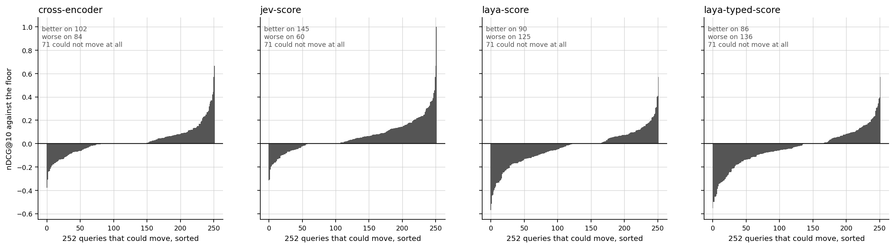
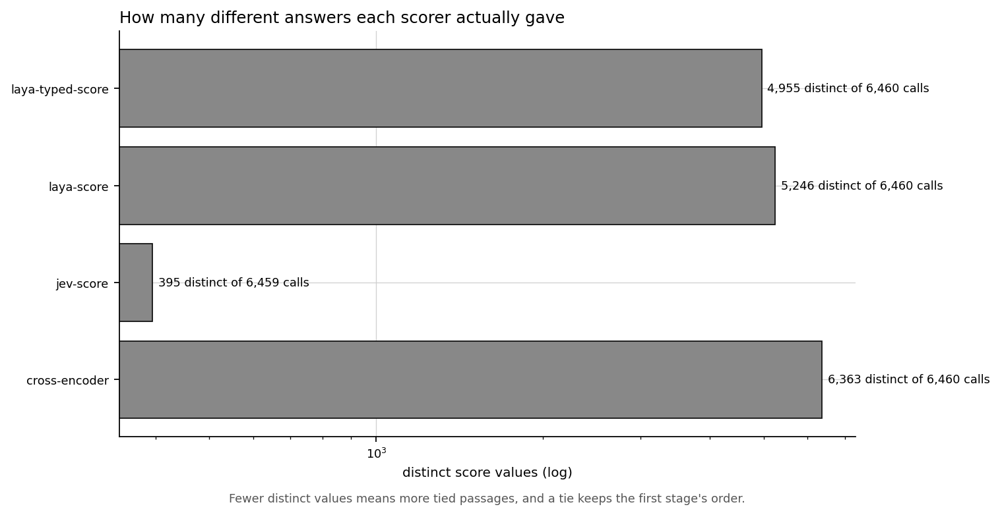

# Results: can a decision model re-rank retrieval better than hybrid search?

What the experiment is and how to run it: [README.md](README.md). What the data holds: [DATASET.md](DATASET.md).

## The finding

**Yes for the hosted decision model, clearly; yes for a cross-encoder, weakly; and no for the open-weights model, which re-ranks worse than leaving the retriever alone.** Over all 323 NFCorpus test queries, Jev moved nDCG@10 by **+0.0478** against the hybrid floor and a MiniLM cross-encoder by **+0.0159**, while both Laya checkpoints came out **negative**, at −0.0241 and −0.0278. All four paired intervals exclude zero.

## The numbers

323 queries, 20 hybrid candidates each, four scorers: **25,840 calls**, one of which failed. $0.16, on an NVIDIA T4.

| Method | nDCG@10 | vs floor | 95% interval | better | worse | same |
|---|---:|---:|---|---:|---:|---:|
| `hybrid` *(floor)* | 0.3306 | — | | | | |
| **`jev-score`** | **0.3785** | **+0.0478** | [+0.0334, +0.0622] | **145** | 60 | 118 |
| `cross-encoder` | 0.3465 | +0.0159 | [+0.0035, +0.0283] | 102 | 84 | 137 |
| `laya-score` | 0.3065 | **−0.0241** | [−0.0390, −0.0093] | 90 | **125** | 108 |
| `laya-typed-score` | 0.3028 | **−0.0278** | [−0.0436, −0.0120] | 86 | **136** | 101 |

*Each bar is one query, sorted. The shape is the finding: Jev's mass sits above the line and its negative tail is the shortest of the four, while both Laya panels are the mirror image. The cross-encoder is nearly symmetric, which is what a +0.0159 mean looks like up close.*

**The means are not the whole story, and the panels show why.** No method is uniformly better. Jev, the clear winner, still made 60 queries worse. The cross-encoder's 102 wins and 84 losses very nearly cancel, and its small positive mean survives only because its wins are slightly larger than its losses.

### It is not only reordering, it is retrieving better

| Method | Recall@10 | MRR@10 |
|---|---:|---:|
| `hybrid` *(floor)* | 0.1612 | 0.5352 |
| `jev-score` | **0.1815** | **0.5905** |
| `cross-encoder` | 0.1660 | 0.5615 |
| `laya-score` | 0.1530 | 0.4910 |
| `laya-typed-score` | 0.1551 | 0.4850 |

Recall@10 rises for Jev because it pulls relevant passages up from positions 11 to 20 into the top 10. MRR@10 rises because the *first* relevant result arrives sooner, which is what a person actually feels. Both Laya checkpoints push relevant passages **down**, out of the top 10.

### What each one costs

| Method | p50 | p95 | Whole pass | Cost |
|---|---:|---:|---:|---|
| `cross-encoder` | **6.8 ms** | 10.7 ms | 48 s | free, local |
| `laya-score` | 37.1 ms | 54.0 ms | 257 s | free, local |
| `laya-typed-score` | 37.0 ms | 53.4 ms | 255 s | free, local |
| `jev-score` | 297.8 ms | 392.6 ms | 2,069 s | **$0.1603** |

Jev's per-call figure is a **network round trip**, not the same measurement as a local forward pass, and it is not a claim about how fast the model is. The three local scorers all ran on the same T4 and are comparable with each other.

$0.1603 over 6,460 calls is **$0.0248 per thousand**. The cross-encoder delivers a third of Jev's gain for nothing, 44 times faster.

### A fifth of Jev's ranking is not Jev's

| Method | Distinct scores | Tied passages | Worst tie |
|---|---:|---:|---:|
| `cross-encoder` | 6,363 of 6,460 | 190 | 2 |
| `laya-score` | 5,246 of 6,460 | 204 | 2 |
| `laya-typed-score` | 4,955 of 6,460 | 204 | 2 |
| **`jev-score`** | **395 of 6,459** | **1,450** | **11** |

Jev's answers land on a two-decimal grid, so a 0-to-4 score has at most 401 places to go, and it used 395 of them. **1,450 of its 6,459 scored passages sit in a tie**, one query having eleven passages on the same value, and a tie keeps the retriever's order. So the +0.0478 is earned while roughly a fifth of the ranking credited to it is still the first stage's. That cuts both ways and this run does not separate them: Jev may be decisive exactly where it matters, or the gain may come from fewer real decisions than 6,460 calls suggests.

### The sample that could not move

Of the 323 queries, **71 have nothing relevant among their 20 candidates**, so every method scores zero on them whatever order it picks. The means above are over all 323, and the per-query table marks which could move. Across all queries the candidates hold **3.64 relevant passages on average**, and at most 20.

## Did the prediction hold?

**There is nothing here to check.** No prediction was recorded before this run. Comparing a result against an expectation recalled afterwards establishes nothing, so this reports no verdict rather than manufacturing one.

## What surprised us

1. **The fine-tune is worse than the checkpoint it was tuned from.** `laya-typed-score` is −0.0278 against `laya-score`'s −0.0241, and it loses on 136 queries against 125. Whatever the `typed-decisions` tune optimised, it was not this task, and it moved the wrong way.

2. **Both open-weights checkpoints are worse than doing nothing at all.** Not merely behind Jev, behind the retriever. A pipeline would be better off deleting them than running them, which is a stronger statement than "underperforms" and is the one the interval supports.

3. **The cross-encoder is the fastest thing in the run**, 6.8 ms against Laya's 37 ms on the same GPU: five times quicker, while being the only local method with a positive result.

4. **Jev improves recall@10 as well as ordering**, 0.1612 to 0.1815. It is not only rearranging the top ten, it is pulling relevant passages into it from below.

5. **Jev's resolution is its own ceiling.** 395 distinct values is not a rounding detail when 1,450 passages tie because of it.

## What this does not answer

- **Whether Jev beats the cross-encoder.** Each interval is against the common floor, and two intervals that both exclude zero do not establish an ordering between them. The paired Jev-minus-cross-encoder difference would, and it was not computed.
- **What Jev's ties are worth.** A fifth of its scored passages hold the retriever's order. Whether finer resolution would add more is untested, and the two-decimal rounding is not something a client can switch off.
- **Whether a fine-tune would rescue Laya.** This is zero-shot by design. The number here is the baseline that would make a later fine-tune interpretable, not a verdict on the architecture.
- **Anything beyond 20 candidates.** Recall@10 is bounded by what the first stage retrieved, and 71 queries had nothing relevant to find.
- **Whether this transfers off NFCorpus.** One corpus, one domain: medical abstracts against health questions.

## Where the output lives

| | |
|---|---|
| `results/gpu/summary.json` | every metric above, and the run's provenance |
| `results/gpu/methods.csv` | the headline table, one row per method |
| `results/gpu/per-query.csv` | 323 rows: the floor's nDCG@10, each method's delta, whether the query could move |
| `results/gpu/scores.csv` | every distinct score value and how many calls landed on it |
| `results/gpu/latency.csv` | one row per successful call |
| `results/gpu/figures/*.png` | generated by the report step from the files above |
| `runs/gpu/scores.jsonl` | the raw wire log, 25,840 records, gitignored |
| `runs/gpu/candidates.json` | the pinned candidate set every method re-ranked |
| `runs/gpu/config.json` | the retrieval settings, the device and the commit |

## Provenance

| | |
|---|---|
| Data | BEIR NFCorpus, official test split: 3,633 documents, 323 queries, official qrels |
| First stage | hybrid: BM25 and `all-MiniLM-L6-v2` each to depth 100, fused by reciprocal rank at `k = 60`, top 20 kept. 39.7 s |
| Models | Jev over OpenRouter's `systemone` route; Laya's base English checkpoint and its `typed-decisions` fine-tune locally; `cross-encoder/ms-marco-MiniLM-L-6-v2` locally |
| Hardware | NVIDIA T4. `laya` runs float16 on CUDA and would run float32 on a CPU |
| Interval | 95% t interval over per-query differences, paired |
| Calls | 25,840, of which 1 failed. That passage kept the retriever's position; nothing was invented for it |
| Spend | $0.1603, from the provider's own per-call figure rather than tokens times a rate |
| Commit | `a41a908`, recorded by the run rather than by the report |
| Finished | 2026-09-26T18:29:46Z |
| Reproduces | re-running the report over the same wire log reproduces every method row exactly, differing only in the timestamp |

**Claims here are measured in this run.** The paired differences are computed over the queries both a method and the floor scored, and the failed call is reported rather than dropped.
