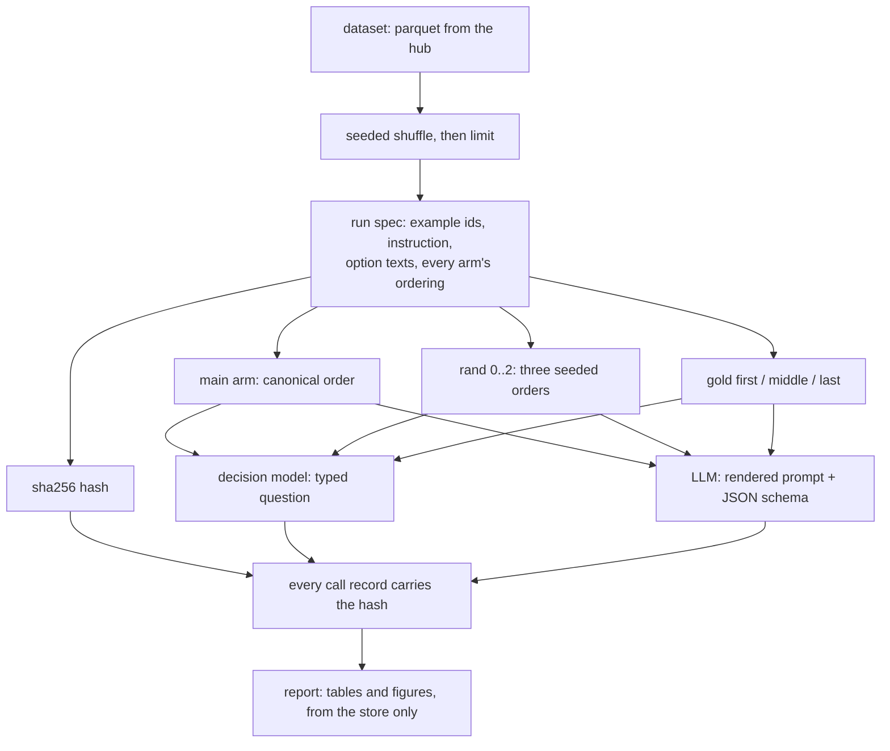

# Many models, one job: what a typed decision costs at 4 options and at 151

Results: [RESULTS.md](RESULTS.md).

Results, once there are any: [RESULTS.md](RESULTS.md). This file is the protocol, and it is written before the run.

## The question

For one job — assign a piece of text to exactly one of a fixed list of labels — how do a decision model and a wide slate of hosted LLMs compare on accuracy, latency, cost, validity, **positional robustness** and **whether they hand back a probability at all**, when the option list is 4 long and when it is 151 long?

## Motivation

A decision model answers a typed question in one forward pass and hands back a probability for every option. An LLM answers by generating text that has to be parsed back into a decision, and it carries the whole option list in its prompt on every call.

Three things follow, and only one of them is usually measured.

1. **Cost scales with the option list for an LLM and not for a decision model.** That is the arithmetic this experiment's earlier versions were about, and it is still here.
2. **An ordered list has a top and a bottom.** An LLM reads its options as text in an order somebody chose. A decision model scores each option at its own marker and never sees them as a sequence. If an LLM's answer changes when only the order changes, that change is pure error — the example is identical, the options are identical, the correct answer is identical. At 4 options this is a curiosity. At 151 it may be the dominant failure mode, and nobody who ships an intent classifier reorders their label list to find out.
3. **A label is not a probability.** An LLM in structured mode returns the name of an option. A decision model returns a distribution. Without a distribution there is no threshold, so "route this one to a human when the model is unsure" — the single most common production requirement for a classifier — is not available from that model at any price. This is reported as a first-class column rather than a footnote.

What changes depending on the answer: whether a typed decision is worth routing to a decision model at all. If the two are within noise on accuracy, cost and robustness, the LLM wins on flexibility and nobody should add a second kind of model to their stack.

## What we expect

**This section is written and committed before any measured call.** The commit that adds it is the one that adds the position-bias harness, and no call record exists at that point; `git log` on this file, against the run directory's contents, is the check.

> **Position bias will be negligible for every model on AG News with 4 options, substantial for the LLMs on CLINC150 with 151 options, and near zero for Jev and Laya at both, because they score each option at its own marker rather than reading an ordered list.**

Concretely, what we expect to see:

- **AG News, 4 options.** Flip rate under ~5% for every model. Accuracy at gold-first, gold-middle and gold-last within ~0.03 of each other for every model, decision models and LLMs alike.
- **CLINC150, 151 options.** Flip rate above ~20% for the LLMs, and accuracy varying by more than ~0.10 across the three gold placements. We expect the *direction* to favour early positions, so `gold:first` > `gold:last`, and the chosen-position distribution to lean towards the top of the list.
- **Jev and Laya at both option counts.** Flip rate at or very near zero and a spread at or very near zero, because the ordering of a `criteria` map is not information those models consume as a sequence.

### What would falsify it

Each of these is a falsification, and each is reported as such if it happens:

- **The LLMs show a flip rate under 10% and a gold-placement spread under 0.05 on CLINC150.** Then long option lists do not induce position bias at the scale that matters, and the argument in the motivation is wrong.
- **Jev or Laya shows a non-trivial flip rate or spread at either option count.** Then "scores each option at its own marker" does not deliver order-independence in practice, and the mechanism claimed for decision models is wrong. This is the outcome that would most surprise us, and it is why both bias arms run on the decision models too rather than only on the LLMs.
- **AG News shows substantial bias.** Then the effect is not about list length at all, and the 4-against-151 design is measuring the wrong axis.
- **The direction is reversed** — `gold:last` beating `gold:first` on CLINC150 — which would still be position bias, but not the story the mechanism suggests, and would need a different explanation.

A flip rate alone cannot falsify the directional part of the prediction, which is exactly why the controlled gold-placement arm exists alongside it.

### What we are not predicting

Nothing about the accuracy, cost or latency rankings. Those are measurements this experiment reports; they are not what it is testing.

## Data

What it holds, with real rows: **[DATASET.md](DATASET.md)**, written by `uv run cli dataset typed_decisions`.

Two public, labelled classification datasets, chosen to bracket the option count as widely as public labelled data allows. Both are loaded by this experiment's own `tasks.py` from the parquet files the Hugging Face hub serves, verified against the hub rather than assumed.

| task | repo | config | split | rows | options | licence |
| --- | --- | --- | --- | --- | --- | --- |
| `ag_news` | `fancyzhx/ag_news` | `default` | test | 7,600 | 4 (World, Sports, Business, Sci/Tech) | **unknown** |
| `clinc150` | `clinc/clinc_oos` | `plus` | test | 5,500 | 151 (150 intents plus `oos`) | CC-BY-3.0 |

**AG News' licence is listed as `unknown` on the hub**, and it is recorded here as unknown. This protocol does not establish a licence for it and does not assume it is permissive. It is used as a benchmark, measured and reported, with no redistribution of the corpus.

**CLINC150 ships three configs** — `small`, `imbalanced` and `plus` — which differ only in their *train* split and **share one 5,500-row test split**. This experiment uses **`plus`**, because the validation rows for the calibration fit are carved out of train and `plus` is the largest of the three (15,250 rows). Every reported number comes from the shared test split, so the config choice affects only what the temperature was fitted on.

Its test split is deliberately imbalanced: `oos` has 1,000 rows and the other 150 intents have 30 each. That is the benchmark's design, not a sampling error, and it means a model that answers `oos` to everything scores 0.18.

**The label names are read out of each parquet file's own `ClassLabel` metadata**, never written down in this repository, so a dataset that renames or reorders its classes cannot silently shift every label by one.

**Both splits are shuffled with a fixed seed (0) before any limit is applied.** CLINC's test split ships sorted by intent — its first thirty rows are all `translate` — so `--limit 50` on the raw order would measure two intents out of 151 and produce a number that looks entirely reasonable. This repository has made exactly that mistake once.

### Not imported from a sibling experiment

The previous version of this experiment did `from banking77 import data, options`. That was a defect. The `banking77/` experiment **deliberately varies its option texts as part of its method**, so this experiment's task changed silently whenever that one ran an arm. One experiment, one directory, self-contained — the same choice `rerank/` makes when it copies from `arena/` rather than importing.

## Method



### The frozen run spec, and why it is the centre of the design

Models will be added to this slate later, and they have to be comparable against today's numbers **without re-running anything**. That is only sound if every model saw byte-identical inputs, and "byte-identical" has to be checkable rather than promised.

So `spec.py` freezes, in one JSON payload: the dataset, config and split; the seed and the ordered list of example ids the shuffle produced; the gold label of each; the instruction text verbatim; the option texts verbatim in their canonical order; every position-bias ordering, per example, as indices into that canonical order; and the validation example ids. It hashes that payload with SHA-256.

- **Every stored call records the spec hash**, and the resume key is `(spec hash, model, task, arm, example, pass)`.
- **`run --models <names>`** fills only the records missing for those models against the current spec, and runs nothing else.
- **`report --models a,b,c`** computes the full table over any named subset, purely from the store, calling nothing.
- **The report refuses to mix records whose spec hashes differ**, with an error naming what changed. A regenerated example list or a reworded instruction fails loudly rather than producing a comparison that looks entirely normal and is quietly invalid.
- Change the instruction text and the hash moves, so nothing matches, so the run refills rather than finishing instantly against a different experiment.

The orderings live *in* the spec rather than being regenerated per model from "the same seed", because a seeded shuffle recomputed in each model's process is one library upgrade away from two models seeing different lists.

### Adding a model is configuration, not code

A hosted model is one line in `catalog.py` mapping a CLI name to an OpenRouter catalogue prefix — the exact id is still resolved live and probed for entitlement, so nothing is hardcoded — or `--models name=exact/id` on the command line. A local model is one line naming an adapter `module:Class`. Adding a second local decision model later is one new module and one registry line, and neither `run.py` nor `report.py` learns its name.

### The arms

| arm | examples | what varies | counts towards |
| --- | --- | --- | --- |
| `main` | all | nothing | latency, cost, tokens, accuracy, validity, determinism |
| `rand:0` `rand:1` `rand:2` | the bias subset | the option order, three seeded permutations, **identical across every model** | the flip rate |
| `gold:first` `gold:middle` `gold:last` | the bias subset | where the correct option sits; the other options keep one fixed background order, so position is the only thing that moves | accuracy by position, and the spread |
| `validation` | rows from **train** | nothing; probabilistic models only | the calibration temperature, and nothing else |

**Only `main` feeds the headline numbers.** The bias arms re-ask examples that are already in `main`, so folding them in would weight those examples six times over in the latency and cost tables. The subset size is stated everywhere the bias numbers appear.

### The slate

Seven hosted families plus the two decision models. Ids are resolved from OpenRouter's live catalogue at run time, **current generation first and cheapest tier within it**, then probed with one tiny call because the catalogue lists far more models than an account is entitled to call. The resolved id, its dated `canonical_slug`, its release month and **every id that was refused above it** go into `config.json`, so a family reached only at an older generation says so rather than passing as a current comparison.

`glm` · `phi` · `gemma` · `deepseek` · `llama` · `qwen` · `gpt` · `jev` · `laya`

**Gemini is not on the slate.** In an earlier run of this harness it emitted 318 completion tokens to answer a one-word multiple-choice question and would have been roughly 80% of the bill on its own.

**Claude is not on the slate.** The only current-generation Claude this account can reach is an Opus tier, and nobody deploys a flagship reasoning model to classify support intents. Putting one in a cost-per-decision table answers a question nobody asked.

**Qwen is deliberately not the flagship.** `-max` and `-prime` tiers are denied in `catalog.py`, so Qwen gets the same cheapest-tier-of-the-current-generation rule as every other family. `:free` mirrors are denied too, for the same reason `:batch` is: a rate-limited queue is a different product with a different latency and must never reach a latency table.

**Jev is pinned** to the dated build `typesafe/jev-1.13-20260917`. `typesafe/jev-1.13` is a floating minor and `~typesafe/jev-latest` is an alias; neither is safe to benchmark against.

**Laya runs on this machine's CPU.** There is no usable GPU here, so its latency is not comparable to a hosted call and it is grouped separately and labelled in every table and figure.

### The fairness rules

These decide whether the result is worth publishing.

1. **The LLMs get their best shot.** Every LLM call uses OpenRouter's structured-output mode: `response_format` with a `json_schema` whose `choice` property is a strict `enum` of the option keys. `config.json` records which mode each model ran in.
2. **Identical semantics.** The instruction text and the option texts are the same words for every model, read off the same frozen spec. Only the transport differs.
3. **Temperature 0** where the model accepts one, `null` where it does not, recorded per model, never silently assumed.
4. **No retry-until-valid.** One call, one answer. Transport errors (429, 5xx) are retried because none of them is an answer; an unparseable *answer* is a result. A repaired answer is a different product with a different latency.
5. **Cost comes off OpenRouter's own per-call `usage.cost`**, never tokens times a rate from a pricing page. The only place a price list is used is the pre-run spend estimate, which is labelled as an estimate.
6. **`reasoning_effort: minimal`** where the model advertises the parameter, nothing sent where it does not.
7. **The option-token overhead is measured, not counted**: the same prompt is sent twice, once with the option block and once without, and the provider's own reported prompt tokens are differenced. The second call keeps structured mode on and takes only the options out of the schema, because some providers bill a `json_schema` as a tool definition.
8. **Nothing is ever fitted on test.** The calibration temperature is fitted on a validation split carved out of **train**, stratified by label.
9. **Warm-up calls come from outside the measured window** where there are examples to spare, so provider-side prompt caching cannot make a measured call look faster or cheaper than a cold one.

### Every call is on the wire

One line per `(spec hash, model, task, arm, example, pass)` in `typed_decisions/runs/<tag>/calls.jsonl`, holding the exact request, the exact response, the provider's own usage block, latency on both clocks, the validity verdict and its detail, retries, the transport, **the option order that actually went over the wire**, the returned probability distribution where there is one, and OpenRouter's per-call cost.

## Metrics

**Kept from the previous version, all still reported.**

- **Latency on two clocks.** `latency_ms` is the attempt that succeeded, with retry backoff deliberately outside the timer; `wall_ms` is the whole call including backoff. Reported as p50 and p95, nearest-rank, so every latency reported is one some call actually had.
- **Tail ratio**, p95 / p50. A model with a 10x tail is worse in production than a slower steady one, and a p50-only table hides it.
- **Input and output tokens**, from the provider's own usage block.
- **Cost per 1,000 decisions**, from OpenRouter's per-call `usage.cost`.
- **Cost per correct decision** — cost per call over accuracy. The headline, because half the price at half the accuracy is the same price per decision you can act on. Undefined, not infinite, at zero accuracy.
- **Validity by kind**: `valid`, `unparseable`, `not_an_option`, `refusal`, `api_error`. No retry-until-valid.
- **Accuracy with a bootstrap CI**, and **paired** per-item differences against the most accurate model, over **the intersection of the examples both models answered**, with that count reported. Two overlapping intervals say nothing about how two models compare to each other.
- **Determinism** as a disagreement rate over a repeated subset, with the subset size stated.
- **The option-token overhead**, and **input tokens for one identical prompt** across models.

**New in this version.**

- **Position bias, two arms.**
  - *Random orders*: each example in the bias subset under 3 seeded orderings, **identical across all models**. Reported as the **flip rate** — the share of examples whose answer is not the same across all three. An example missing one of the three is excluded and counted, not scored; a model that failed a call has demonstrated neither stability nor a flip.
  - *Controlled gold placement*: the correct option placed deliberately **first**, **middle** and **last**, with the other options in one fixed background order so nothing but the gold position moves. Reported as **accuracy at each position and the spread between them**. This is the causal measure; a flip rate cannot say which positions are favoured.
  - **The distribution of chosen positions** per model, binned, plus a single `mean normalised position`: 0 means the model always picks whatever is listed first, 1 means always the last, 0.5 means no positional preference. It says what *kind* of bias a model has rather than only how much.
  - Both arms run on a **subset**, the size is stated everywhere, and these calls are **excluded from the headline latency and cost** so those examples are not double-weighted.
- **Does it return a probability at all.** A capability column per model, **measured from the records rather than declared**. Jev and Laya return a distribution over every option; an LLM in structured mode returns a label and nothing else. Without a probability you cannot threshold, so "ask a human when unsure" is not available.
- **Calibration**, where probabilities exist: **ECE over 15 bins, raw and after one temperature** fitted on the validation split carved from train. Temperature scaling cannot move the argmax, so it cannot move accuracy; it is a calibration fix and is reported as one. A model with no validation rows gets a raw ECE and no temperature rather than a temperature fitted on test.

### The figures

Every chart is generated by `figures.py` from the same `typed_decisions/results/<tag>.json` the tables are printed from, written as part of the report step with no way to skip it, and committed as PNG so GitHub renders them inline and nobody needs matplotlib installed to read the results. A figure with nothing to show **raises** and writes no file, and the skip is reported with its reason: an empty chart is read as a claim.

`cost-accuracy` · `latency` · `position-bias` · `option-scaling` · `calibration`

Two refusals are worth naming, because both would otherwise be silent lies: a model that returned **no usable answer under any ordering** is left out of the position-bias panel rather than drawn as three flat bars at zero, and a model that **costs nothing to run** is left out of the cost-against-accuracy panel rather than vanishing off the end of a log axis. Both exclusions are printed in the caption.

### The layout

Twelve modules. `tasks.py` holds the two datasets and the tasks built from them; `catalog.py` holds the slate and resolves it against OpenRouter; `prompts.py` is the text transport in both directions, rendering the question out and reading the answer back; `stats.py` is every number reported, calibration included. `spec.py`, `store.py`, `openrouter.py`, `laya_local.py`, `run.py`, `report.py` and `figures.py` are what their names say.

## Assumptions and limits

- **Laya's option budget.** Laya's default `head_max_len` is 192 tokens for the whole option list. **151 CLINC intents do not fit**, so every CLINC150 call to Laya fails with `ValueError: options exceed head_max_len`. This is recorded as an `api_error` validity failure and reported, not worked around: raising the budget is a different model configuration, and it is precisely what the sibling [`banking77/`](../banking77/README.md) experiment exists to study. Laya's CLINC150 row is therefore a structural zero, and the report says so.
- **Laya runs on CPU.** No usable GPU on this machine, so its latency is not comparable to a hosted call and is grouped separately everywhere. It is included because it is the only arm that shows what a typed decision costs when nobody is charging for it.
- **Laya reports no token counts**, so no token or per-token figure exists for it, and it is absent from the option-scaling figure rather than drawn at zero.
- **The account is on a free tier with a $20 monthly cap.** The run reads the remaining balance before it starts and refuses to begin a run it cannot pay for. Rate limits are what make wall clock exceed the successful-attempt latency; that is an artefact of the account, not of the models.
- **A cheap tier is not a family.** Each family is represented by one model — the cheapest tier of its current generation — and the conclusions are about that model, not about everything the vendor ships.
- **The bias subset is small.** Position bias is measured on a subset of the examples, not all of them, and every flip rate and spread carries its `n`.
- **CLINC150's test split is imbalanced by design**, with `oos` at 1,000 of 5,500 rows. Accuracy on it is not comparable to accuracy on a balanced 151-way problem.
- **One dataset per option count.** Any difference between 4 and 151 options is confounded with the difference between topic classification and intent classification. The experiment cannot separate them.

## How to run it

```bash
# price the run without paying for it: measures the option-token overhead,
# prints the projection per model, checks the account balance, and stops
python -m typed_decisions.run --models all --tasks ag_news,clinc150 --limit 300 \
    --tag full --probe-only

# the pilot
python -m typed_decisions.run --models all --tasks ag_news,clinc150 --limit 5 \
    --bias-subset 2 --validation 4 --warmup 1 --repeat 2 --tag pilot
python -m typed_decisions.report --tag pilot

# add a model later, against the same frozen spec, without re-running anything
python -m typed_decisions.run --models mistral=mistralai/mistral-small --tag full
python -m typed_decisions.report --tag full --models jev,laya,gpt,mistral
```

| flag | what it does |
| --- | --- |
| `--models` | `all`, or a comma-separated subset of `glm,phi,gemma,deepseek,llama,qwen,gpt,jev,laya`; `name=model-id` pins one to an exact id. Fills only the records missing for those models |
| `--tasks` | `ag_news`, `clinc150`, or both |
| `--limit` | first N examples per task after the seeded shuffle (0 = all) |
| `--arms` | `main`, `bias`, `validation`, comma-separated |
| `--bias-subset` | how many leading examples the position-bias arms cover |
| `--validation` | rows carved out of **train** to fit the calibration temperature on |
| `--warmup` | warm-up calls per model per task, not recorded |
| `--repeat N` | ask the first N examples a second time, to measure determinism |
| `--threshold` / `--yes-spend` | **cost guard.** The run prices itself from the probe's *measured* tokens, prints the per-model breakdown, and refuses to spend more than `--threshold` (default $1.00) without `--yes-spend`. It also refuses a run costing more than the account's remaining cap |
| `--probe-only` | measure the overhead, price the run, stop |

The run is **resumable**: every `(spec hash, model, task, arm, example, pass)` already in `calls.jsonl` is skipped, so a killed run is restarted with the same command.

### Tests

```bash
python -m pytest typed_decisions/tests -q
```

Test-driven: the dataset loaders and the shuffle-before-limit rule; the spec hash's stability under re-derivation and its sensitivity to every pinned input; the resume key including the spec hash; the report's refusal to mix hashes, and the equality of a subset report with the full report restricted to the same models; the flip rate, accuracy by gold position and the chosen-position distribution; paired differences over the intersection; ECE and the temperature fit; the registry; catalogue ranking and family resolution; prompt rendering; validity classification; percentiles and the bootstrap CI; the spend estimate; and the transport's retry behaviour against a fake HTTP post, including that backoff never lands in the reported latency and that an answer is never asked for twice. The figure writer is tested for the files it produces and for raising rather than drawing an empty chart when a metric is absent.

## Protocol amendments

### 2026-09-24 — rebuilt: two new datasets, nine models, a frozen run spec, and position bias

Superseding the `latency/` and `decision_cost/` versions of this experiment. `git log --follow typed_decisions/run.py` traces the whole history.

1. **The folder is `typed_decisions/`.** Its third name: `latency/` undersold it, and `decision_cost/` named one of the quantities rather than the subject.
2. **The task is decoupled from `banking77/`.** See *Data*. The old import made this experiment's task change whenever that one ran an arm.
3. **Two new datasets, AG News and CLINC150**, replacing `highway` (no ground truth) and `banking77` (imported). 4 options against 151 brackets the axis far better than 5 against 77.
4. **The model slate grew from four families to seven**, and dropped Gemini and Claude for the reasons stated above.
5. **The frozen run spec** and its hash, which is the point of the rebuild: models can be added later and compared without re-running anything.
6. **Position bias**, both arms, with the prediction above recorded before any measured call.
7. **The probability-capability column and calibration.**
8. **Figures are generated by code** from the results file, as part of the report step.

### 2026-09-24 — earlier: the transport moved to OpenRouter

The Vercel AI Gateway key was deleted, so every hosted call goes over OpenRouter. **Nothing measured before that date is comparable to anything measured after it** — different provider, routes and models — so `transport` is recorded on every call and is part of the report's grouping key. The LLMs use `POST /api/v1/chat/completions`; Jev uses `POST /api/v1/systemone`, the only route that accepts the decision shape. Model ranking changed from cheapest-first to current-generation-first, cheapest tier within the generation, because ranking on price alone resolved every family to a 2025 model even where the current one was reachable.
