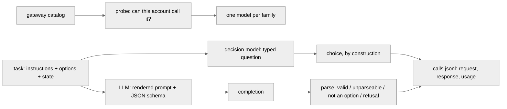

# What does one typed decision cost?

**Status:** `piloted`

Results so far: [RESULTS.md](RESULTS.md). This file is the protocol.

## The question

For the same decision, what does one answer cost in latency, tokens, money and validity, asked of a decision model against one LLM per family?

## Motivation

A decision model answers a typed question in one forward pass and hands back a probability per option. An LLM answers by generating text that has to be parsed back into a decision. Everything hosted goes through **OpenRouter** (see amendment 2026-09-24; it went through the Vercel AI Gateway before that, and those numbers are not comparable). Laya runs locally on this machine's CPU and is grouped separately in every table, because that number is not comparable to a hosted call.

What changes depending on the answer: it decides whether a typed decision is worth routing to a decision model at all. If one decision costs the same either way, the LLM wins on flexibility and nobody should add a second kind of model to their stack. If the option list is what an LLM is billed for, then the wider the label set, the stronger the case for a model that does not carry the options in its prompt, and the `banking77/` and `rerank/` experiments are asking the right question.

## What we expect

The prediction and where it is recorded, all of it in the harness that produced the pilot:

- **Options are free for a decision model and expensive for an LLM.** Recorded in the module docstring of `typed_decisions/tasks.py`: *"The point of the pair is that options are free for a decision model and are charged for on every LLM call. So the same models answer the same kind of question twice, once with five options and once with seventy-seven, and the report shows how the cost of one decision scales with the length of the option list."* The same sentence heads the design section of this protocol, and commit `36047b5` states it again.
- **There is a parsing tax, and it should show up where the option list is long.** Recorded in the module docstring of `typed_decisions/parse.py`: *"a model that is fast and returns prose you cannot parse has not done the job"*, which is why validity is a first-class result and why nothing is repaired or re-asked.
- **The account, not the model, is expected to dominate wall clock.** Recorded in commit `36047b5`: *"Latency is split across two clocks, the successful attempt, and wall clock including retry backoff, so a rate limit is never charged to a model's speed and never disappears either."*

**What would falsify the first one:** the measured option-token overhead being a small share of the prompt at 77 options, or the per-decision cost of a decision model and an LLM staying within noise of each other as the option count grows. The two-task design exists so that this is a measurement rather than an argument: the same models answer the same kind of question at 5 options and at 77.

**Git evidence, stated plainly.** `typed_decisions/` arrived in the repository as one commit, `36047b5` (2026-09-24T16:22:58-05:00), which carries the harness, the docstrings quoted above, the pilot's run artifacts and the first version of this write-up together. So `git log` proves those records predate this documentation change, and it does **not**, on its own, prove each docstring was typed before the pilot ran. What it shows is that the quoted sentences live in the modules the pilot was executed through: `tasks.py` built the examples and `parse.py` classified every answer. The run's own `config.json` is stamped `2026-09-24T16:22:15`, 43 seconds before the commit.

## Data

Two tasks, five options and seventy-seven, both built from data that already exists in this repo or next to it. Same examples for every model within a task, one fixed seed (0), shared permutation.

| task | options | where it comes from | ground truth |
| --- | --- | --- | --- |
| `highway` | 5 | the arena's recorded highway-env episodes (`arena/runs/highway/jev/seed-*.json`), the states and the question, word for word including all five option descriptions | **none.** The game ships only `idle` and `random` baselines, no reference policy, so the report gives model-to-model **agreement**, not accuracy |
| `banking77` | 77 | the existing [`banking77/`](../banking77/README.md) harness: its loader, its frozen option texts and its seeded shuffle are imported, not reimplemented, so the examples are the same rows in the same order | the benchmark label |

Episodes are recorded in step order, so the examples are shuffled once with a fixed seed shared by every model, which makes a `--limit` a sample rather than a prefix.

**Licence:** not recorded in this repository for either source, and this protocol does not establish it. The highway episodes are this project's own run artifacts; BANKING77 comes from the PolyAI repository named in [`banking77/README.md`](../banking77/README.md).

## Method



**The arms** are six models, `gpt`, `claude`, `gemini`, `gemma`, `jev`, `laya`, each answering both tasks.

**What varies:** the model, and the option count between the two tasks.

**What is held fixed:** the instruction text and the option list, the same words for every model including Laya and Jev. Only the transport differs. Temperature 0 where the model accepts one. 20 warm-up calls per model per task, drawn from outside the measured window where there are examples to spare, so provider-side prompt caching cannot make a measured call look cheaper than a cold one.

**Seeds:** `seed 0`, recorded in `config.json`, for the shared permutation of examples. The bootstrap CI in `stats.py` takes its own fixed seed.

### The fairness rules

These decide whether the result is worth publishing.

1. **The LLMs get their best shot.** Every LLM call uses OpenRouter's structured-output mode, `response_format` with a `json_schema` whose `choice` property is a strict `enum` of the option keys. A family whose only reachable model cannot do that would run in a strict-prompt arm instead, and `config.json` records which arm each model ran in, because it changes both latency and validity.
2. **Identical semantics.** The instruction text and the option list are the same words for every model, including Laya and Jev. Only the transport differs.
3. **Temperature 0**, recorded per model; `null` for a model that does not accept one (the newer GPT-5 and Claude tiers reject it), never silently assumed.
4. **No retry-until-valid.** One call, one answer. Transport errors (429, 5xx) are retried because none of them is an answer; an unparseable *answer* is a result. A repaired answer is a different product with a different latency, and repairing quietly is how benchmarks lie.
5. **Cost comes off OpenRouter's own per-call `usage.cost`.** Never tokens times a rate from a pricing page. The only place a price list is used is the pre-run spend estimate, and it is labelled as an estimate.
6. **Reasoning effort is `minimal` where the model advertises the parameter**, and nothing is sent where it does not — the same shape as the temperature rule, recorded per model. The current tiers are reasoning models, and left alone one of them spent its whole answer budget thinking and returned no answer at all.
7. **The option-token overhead is measured, not counted.** For each model and task, the same prompt is sent twice, once with the option block and once without, and the provider's own reported prompt tokens are differenced.

### The instrument

- **`catalog.py`** no model id is written down anywhere in this experiment. OpenRouter is asked what it hosts, the catalog is filtered (text models that expose structured outputs, minus `-fast` / `-pro` / `codex` / image / `:batch` variants) and ranked **current generation first, cheapest tier within it**, then the ranked candidates are **probed with one tiny call** until one answers. That last step is not optional: the catalog lists 460 models and this account is entitled to a fraction of them. The decision models are **not in the default listing at all** and are fetched from `?output_modalities=decisions`, so Jev is pinned to an explicit dated build rather than ranked.
- **`prompts.py`** the one place the experiment could cheat, so it is mechanical. The instruction line goes in verbatim; every option key and description goes in verbatim and in order; an option with no description renders as the bare key, which is exactly how laya renders it. The only thing added is one shared `ANSWER_DIRECTIVE`. That is the transport, and it is identical for every LLM.
- **`openrouter.py`** the wire. `POST /api/v1/chat/completions` for the LLMs, `POST /api/v1/systemone` for Jev — `chat/completions` rejects the decision shape outright. Rate limits and 5xx are retried with exponential backoff **outside the timer**: `latency_ms` covers only the attempt that succeeded, `wall_ms` covers the whole call including backoff, so queueing is never charged to a model's speed and never disappears. Every record carries `transport`, so OpenRouter numbers and the older Vercel ones can never be averaged.
- **`parse.py`** validity, as a first-class result. The answer is the `choice` field of a JSON object, spelled exactly as the option is spelled. No fuzzy matching, no repair, no second call.
- **`laya_local.py`** Laya from the weights on disk (`LAYA_PATH` honoured), on CPU.
- **`store.py`** append-and-flush JSONL, keyed by (model, task, example), which doubles as the resume point.
- **`run.py`** / **`report.py`** the task and the CLI, and the tables.

### Every call is on the wire

One line per (model, task, example, pass) in `typed_decisions/runs/<tag>/calls.jsonl`, holding the exact request, the exact response and the provider's own usage block, plus latency on both clocks, the validity verdict and its detail, retries, the **transport**, the repeat pass, and OpenRouter's per-call cost. `config.json` records every resolved model id, OpenRouter's version block and dated `canonical_slug` for it, **every id that was refused above it**, which arm it ran in, its temperature and reasoning effort, the option-overhead measurement, the seed and the library versions.

## Metrics

- **Latency on two clocks.** `latency_ms` is the attempt that succeeded, `wall_ms` is the whole call including retry backoff. Both, because the first alone hides queueing and the second alone charges the account's rate limit to the model's speed. Reported as p50 and p95, nearest-rank so every latency reported is one some call actually had.
- **Input and output tokens**, from the provider's own usage block, because that is what the bill is computed from.
- **Cost per 1,000 decisions**, from OpenRouter's per-call `usage.cost`.
- **Cost per correct decision** — cost per call divided by accuracy, per model per task. The headline number, because dollars per call is misleading when accuracy differs between arms: half the price at half the accuracy is the same price per decision you can act on. Undefined, not infinite, where accuracy is zero or the task has no gold.
- **Tail ratio**, p95 / p50. A model with a 10x tail is worse in production than a slower steady one, and a p50-only table hides it: the Vercel pilot had one model at 689 ms p50 against 7,093 ms p95.
- **Determinism**, as a disagreement rate. `--repeat N` asks the first N examples a second time and the report gives the share of them answered differently. Both answers stay in the log. Measured on a **subset**, and the report says so. A decision model should be exactly reproducible; an LLM at temperature 0 often is not.
- **Input tokens for one identical prompt**, across models. Taken from the overhead probe, which sends every model the same example in the same words, so the spread is each model's tokenizer and protocol overhead rather than a difference in the prompt.
- **The option-token overhead**, measured by differencing the prompt tokens of the same call with and without the option block. This is the quantity the experiment exists to measure.
- **Validity**, as one of `valid`, `unparseable`, `not_an_option`, `refusal`, `api_error`. A model that is fast and returns prose you cannot parse has not done the job.
- **Retries**, counted separately, because they are the account's behaviour rather than the model's.
- **Agreement** between models on `highway`, since that task has no ground truth, and **accuracy** on `banking77`, which has.

## Assumptions and limits

- **The Claude arm is a flagship, the others are cheap tiers.** Under the current-generation-first rule, the newest Claude this account can reach is `anthropic/claude-opus-5.5` — there is no 2026-09 Haiku or Sonnet in the catalog — while GPT, Gemini and Gemma all resolve to their cheap tier. So the Claude row is an Opus-class model against everyone else's nano/flash/small model, and its cost per decision should be read as that and not as "Claude is expensive". `--models claude=<id>` exists to pin a cheaper tier.
- **The account is on a free tier with a $20 monthly cap.** The run checks the remaining balance before it starts and refuses to begin a run it cannot pay for. Rate limits are what make wall clock exceed the successful-attempt latency; that is an artifact of the account, not of the models, which is why the two clocks are reported separately and never merged.
- **The current tiers are reasoning models.** GPT, Claude and Gemini all bill thinking tokens on a one-word decision, and their `reasoning_effort` is pinned to `minimal` where the parameter exists. Left at the provider default, one model spent its entire answer budget thinking and returned nothing — an instrument failure that would have been recorded as a validity failure.
- **Agreement is not quality.** With no reference policy on `highway`, the report gives pairwise agreement, and a model that answers with a constant will agree with everyone who agrees with the constant. The arena's `idle` baseline exists precisely because a constant is not a driver.
- **Laya runs on this machine's CPU.** There is no usable GPU, so its latency is not comparable to a hosted call and it is grouped separately everywhere.
- **Laya reports no tokens**, so no token or per-token cost figure exists for it.
- **`highway` has no ground truth.** Five-option accuracy is not measurable in this experiment at all.

## How to run it

```bash
# the pilot: 10 examples per model, 5-option task, 5 of them asked twice
python -m typed_decisions.run --models all --tasks highway --limit 10 --repeat 5 --tag or-pilot
python -m typed_decisions.report --tag or-pilot

# price a run without paying for it
python -m typed_decisions.run --models all --tasks highway,banking77 --limit 300 --tag or-full --probe-only

# one arm, pinned to an exact model id
python -m typed_decisions.run --models claude=anthropic/claude-haiku-4.5 --tasks highway --limit 50 --tag full
```

| flag | what it does |
| --- | --- |
| `--models` | `all`, or a comma-separated subset of `gpt,claude,gemini,gemma,jev,laya`; `name=model-id` pins one arm to an exact id |
| `--tasks` | `highway`, `banking77`, or both |
| `--limit` | first N examples per task (0 = all) |
| `--warmup` | warm-up calls per model per task, not recorded (default 20) |
| `--threshold` / `--yes-spend` | **cost guard.** Before any measured call, the run prices itself from the option-overhead probe's *measured* tokens and the catalog's price, prints the per-arm breakdown, and refuses to spend more than `--threshold` (default $1.00) without `--yes-spend` |
| `--probe-only` | measure the option-token overhead and print the price of the run, then stop |
| `--repeat N` | ask the first N examples of each task a second time, after every first pass is done, to measure determinism. Both answers are kept, keyed by pass |

The run is **resumable**: every (model, task, example) already in `calls.jsonl` is skipped, so a killed run is restarted with the same command.

**Expected wall clock and cost.** The pilot is 10 examples per model on the 5-option task. The projected cost and wall clock of the full run are derived from the pilot's measured per-call costs and are reported in [RESULTS.md](RESULTS.md), because they are an output of the pilot rather than an assumption made before it. Money is not the binding constraint at any size considered; wall clock is.

### Tests

```bash
python -m pytest typed_decisions/tests -q
```

The pure logic is test-driven: catalog ranking and family resolution, prompt rendering, validity classification, percentiles and the bootstrap CI, agreement, the spend estimate, the store's resume key, both task loaders, and the transport's retry behaviour against a fake HTTP post, including that the backoff never lands in the reported latency and that an answer is never asked for twice.

## Protocol amendments

### 2026-09-24 — the transport moved to OpenRouter, and three metrics were added

The Vercel AI Gateway key was deleted, so every hosted call now goes over OpenRouter. **Nothing measured before this date is comparable to anything measured after it** — different provider, different routes, different models — so `transport` is recorded on every call and is part of the report's grouping key. The Vercel pilot's numbers survive in [RESULTS.md](RESULTS.md) as a clearly labelled historical section and are never averaged with the new ones.

What changed in the method, and why:

1. **Routes.** The LLMs use `POST /api/v1/chat/completions`; Jev uses `POST /api/v1/systemone`, which is the only route that accepts the decision shape — `chat/completions` rejects it. The decision models are absent from the default `/api/v1/models` listing and are fetched from `?output_modalities=decisions`. Jev is pinned to the dated build `typesafe/jev-1.13-20260917` rather than the floating `typesafe/jev-1.13` or the `~typesafe/jev-latest` alias.
2. **Model ranking changed from cheapest-first to current-generation-first, cheapest tier within the generation.** On OpenRouter, ranking on price alone resolved every family to a 2025 model even where the current one was reachable, which is the silent substitution this protocol forbids. "Cheapest tier" was always the intent — the nano / lite / flash class — and it is now applied inside the current generation rather than across releases.
3. **A temperature is no longer required of a candidate.** Requiring one silently excluded every current-generation GPT and Claude, none of which accept the parameter. Fairness rule 3 already covered this case: temperature 0 where the model takes one, null where it does not, recorded either way.
4. **`reasoning_effort: minimal` where the model advertises it.** The current tiers are reasoning models; at the provider default one of them spent its whole answer budget thinking and returned no answer. `max_tokens` also rose from 64 to 512 as headroom, so a truncated answer is never recorded as a validity failure that was really an instrument failure.
5. **`:batch` variants are denied.** They are an asynchronous queue at half price — a different product with a different latency, which must never appear in a latency table.
6. **Three metrics added**, all test-driven: cost per correct decision, tail ratio (p95/p50), and determinism as a disagreement rate over a repeated subset via `--repeat`. Input tokens for one identical prompt are now reported directly as their own table.

The store key gained a pass index, so the same example asked twice is two records rather than a duplicate the resume logic would skip.
