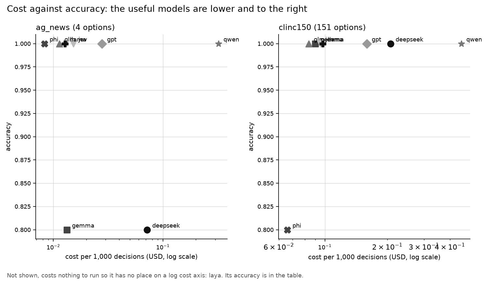
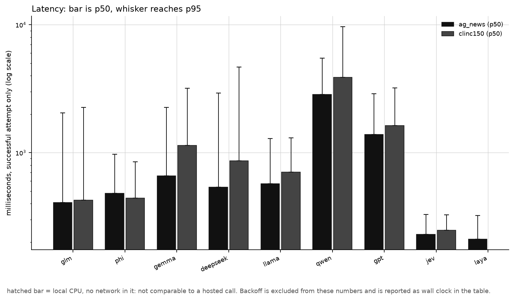
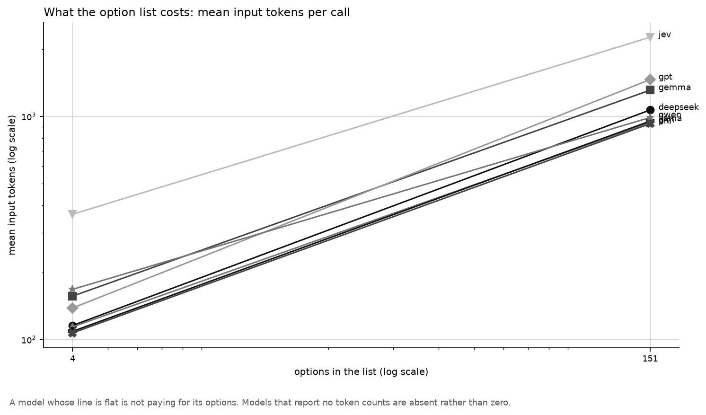
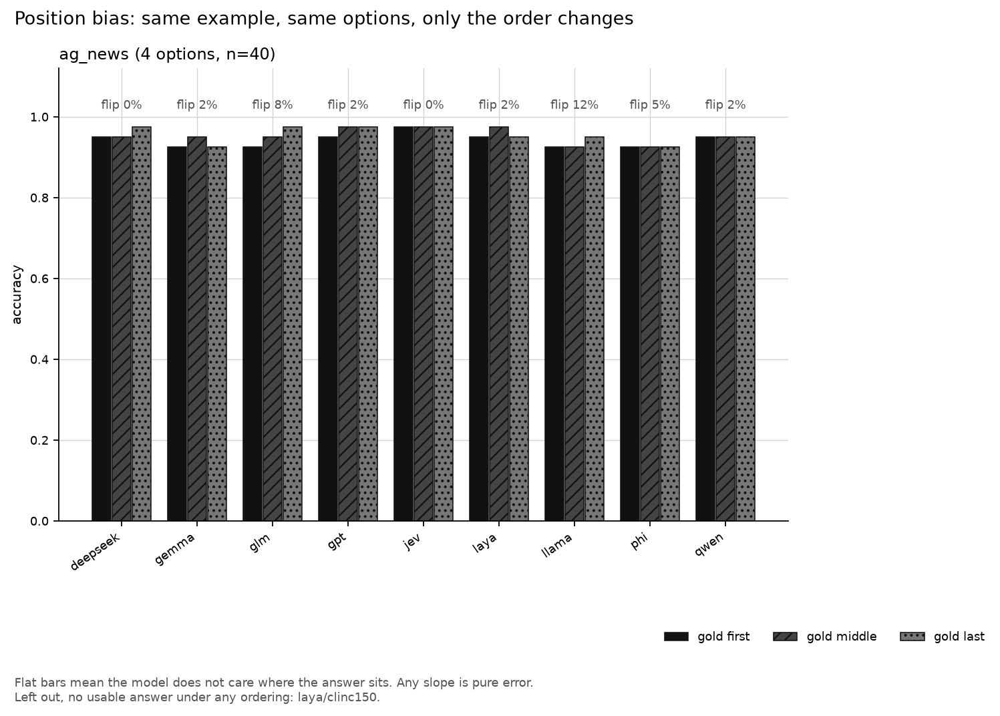
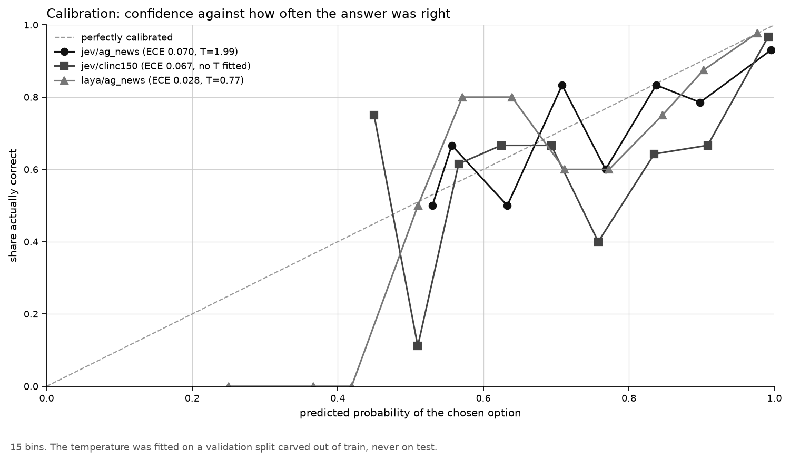

# Results

**Status:** `piloted`. The instrument works on both tasks and all nine models. **The full run has not been launched**, and it is priced at the bottom of this file.

The protocol is [README.md](README.md), committed in `f2893da` **before** the first measured call; the pilot's call records arrived in `48e9a6b`. The prediction about position bias therefore predates the data, and `git log` shows it.

## The finding, one sentence

Every transport, both datasets, all nine models and the whole frozen-spec machinery work end to end for **$0.0293 over 358 calls** — and the pilot is far too small to say anything about position bias, which is the thing the experiment exists to measure, so it does not.

## What the pilot was

```
python -m typed_decisions.run --models all --tasks ag_news,clinc150 \
    --limit 5 --bias-subset 2 --validation 4 --warmup 1 --repeat 2 --tag pilot
```

5 examples per task, a bias subset of **2 examples**, 3 random orderings and 3 gold placements over that subset, 4 validation rows, 1 warm-up per model per task, 2 examples re-asked for determinism. 358 recorded calls, of which 90 are the measured `main` arm and 268 are bias, validation and repeat calls excluded from the headline tables.

Run spec hashes: `ag_news` **d380f59baf56**, `clinc150` **c727bbe2ce10**. Both re-derive byte-identically from `tasks.load(...)`, and both move when the seed moves.

## The model slate, as resolved

Resolved live from OpenRouter's catalogue, current generation first and cheapest tier within it, then probed for entitlement.

| name | resolved id | released | notes |
| --- | --- | --- | --- |
| `glm` | `z-ai/glm-5.3-flash` | 2026-08 | current generation |
| `phi` | `microsoft/phi-4` | **2025-01** | the only Phi this account can reach; a cross-generation row |
| `gemma` | `google/gemma-4-26b-a4b-it` | 2026-04 | current generation |
| `deepseek` | `deepseek/deepseek-v4.1-flash` | 2026-09 | current generation |
| `llama` | `meta-llama/llama-4-scout` | **2025-04** | the newest Llama in the catalogue; a cross-generation row |
| `qwen` | `qwen/qwen3.8-27b` | 2026-08 | **`qwen3.8-flash` was refused at pilot time and accepted an hour later** — see below |
| `gpt` | `openai/gpt-6-luna` | 2026-09 | current generation |
| `jev` | `typesafe/jev-1.13-20260917` | 2026-09 | pinned dated build, `POST /api/v1/systemone` |
| `laya` | local weights, CPU | — | `head_max_len=192`, `max_len=512` |

No Gemini and no Claude, by design; the protocol says why.

**Qwen's resolution is not stable, and it matters.** During the pilot, `qwen/qwen3.8-flash` was refused by the account and the ladder fell through to `qwen/qwen3.8-27b`, roughly four times the input price. On a probe an hour later the same `flash` id answered. So the `qwen` row in this pilot is a *different model* from the one a run started tomorrow may resolve to, and the two must not be compared. What is **measured** is only that one id was refused and later accepted; that entitlement moved is **our inference**.

## The numbers

Every figure below is drawn by `figures.py` from `results/pilot.json`, the same file the tables are printed from.

### ag_news, 4 options, n = 5

| model | id | p50 ms | p95 ms | tail | in tok | $/1k | valid | accuracy |
| --- | --- | ---: | ---: | ---: | ---: | ---: | ---: | --- |
| jev | `typesafe/jev-1.13-20260917` | 211 | 1201 | 5.7 | 363 | 0.0152 | 100% | 1.000 [1.00, 1.00] |
| gemma | `google/gemma-4-26b-a4b-it` | 412 | 996 | 2.4 | 131 | 0.0133 | 100% | 0.800 [0.40, 1.00] |
| phi | `microsoft/phi-4` | 431 | 1418 | 3.3 | 105 | 0.0083 | 100% | 1.000 [1.00, 1.00] |
| llama | `meta-llama/llama-4-scout` | 447 | 606 | 1.4 | 107 | 0.0128 | 100% | 1.000 [1.00, 1.00] |
| gpt | `openai/gpt-6-luna` | 936 | 2302 | 2.5 | 136 | 0.0278 | 100% | 1.000 [1.00, 1.00] |
| deepseek | `deepseek/deepseek-v4.1-flash` | 937 | **24280** | **25.9** | 117 | 0.0718 | **80%** | 0.800 [0.40, 1.00] |
| glm | `z-ai/glm-5.3-flash` | 1128 | 3536 | 3.1 | 133 | 0.0114 | 100% | 1.000 [1.00, 1.00] |
| qwen | `qwen/qwen3.8-27b` | 1596 | 2112 | 1.3 | 178 | 0.3211 | 100% | 1.000 [1.00, 1.00] |
| *laya* | *local CPU, **not comparable to the rows above*** | *234* | *274* | *1.2* | *n/a* | *0.0000* | *100%* | *1.000 [1.00, 1.00]* |

**Seven of nine models scored 1.000 on five examples**, and the intervals say what that is worth: `[1.00, 1.00]` on n=5 is not evidence. **No accuracy conclusion is drawn from this pilot.**

### clinc150, 151 options, n = 5

| model | p50 ms | p95 ms | tail | in tok | $/1k | valid | accuracy |
| --- | ---: | ---: | ---: | ---: | ---: | ---: | --- |
| jev | 211 | 259 | 1.2 | 2264 | 0.0951 | 100% | 1.000 |
| gemma | 504 | 1249 | 2.5 | 1181 | 0.0901 | 100% | 1.000 |
| phi | 511 | 1254 | 2.5 | 928 | 0.0660 | 100% | 0.800 |
| glm | 727 | 1337 | 1.8 | 933 | 0.0836 | 100% | 1.000 |
| llama | 790 | 885 | 1.1 | 952 | 0.0975 | 100% | 1.000 |
| gpt | 1125 | 3495 | 3.1 | 1462 | 0.1591 | 100% | 1.000 |
| deepseek | 1316 | 2472 | 1.9 | 1042 | 0.2072 | 100% | 1.000 |
| qwen | 1383 | 4306 | 3.1 | 976 | 0.4539 | 100% | 1.000 |
| **laya** | n/a | n/a | n/a | n/a | 0.0000 | **0%** | — |



*Cost per 1,000 decisions against accuracy, one point per model per task, log cost axis. At n=5 almost every model sits on the same accuracy line, so what this chart shows today is the **30x spread in price** between `phi` and `qwen` for the same answer, not a quality frontier. Laya is absent because it costs a true zero and a zero has no place on a log axis; its accuracy is in the table.*



*Bar is p50, whisker reaches p95, log scale, backoff excluded. The bar to read is `deepseek` on ag_news: a 937 ms median against a 24.3-second p95, a **25.9x tail** on five calls. A p50-only table would have called it mid-field.*

### Laya cannot do CLINC150 at all

Every one of Laya's 5 CLINC150 calls failed with, verbatim from the call record:

```
ValueError: question 'decision' options exceed head_max_len=192
```

151 intent names do not fit a 192-token option budget. This is a **structural** zero, not a model getting 151-way classification wrong, and the report says so rather than printing a bare accuracy of 0.000: the row shows `{'api_error': 5}` and `0%` valid, and the position-bias table marks it `0/12 usable` with no flip rate at all. Raising `head_max_len` is a different model configuration, and it is exactly what the sibling [`banking77/`](../banking77/README.md) experiment exists to study, so it is not done here.

Laya also emits this on load, verbatim:

```
laya: this checkpoint ships invalid temperatures or values outside [0.5, 5];
using choice:11+=0.10058280825614929 -> 0.5. Treat confidence from the affected
entries as uncalibrated.
```

Its own checkpoint says its confidences are uncalibrated. Recorded here because the calibration section below reports an ECE for it.

### What the option list costs

| task | option tokens as a share of the billed prompt |
| --- | --- |
| ag_news, 4 options | 9% – 17% (deepseek 9%, glm 10%, phi 11%, qwen 16%, gpt 17%) |
| clinc150, 151 options | **90% – 96%** (qwen 90%, glm 93%, phi 93%, llama 93%, deepseek 94%, gpt 94%, gemma 96%) |

At 151 options the option list is nine tenths of what an LLM is billed for on every single call. This reproduces the earlier finding of this experiment on an entirely different dataset and a different model slate.



*Mean input tokens per call at 4 options against 151, log-log. **Jev is not free on options either** — 363 tokens to 2,264, a 6.2x rise — but its slope is shallower than the LLMs' (phi 105 to 928, 8.8x) and it starts from a much higher floor. The honest reading is "cheaper per option, not free": at 4 options Jev is billed **3.3x** the input tokens of the cheapest LLM for identical text.*

One measurement is not usable: on one probe pass `gemma/ag_news` reported **fewer** prompt tokens with the option list than without it (118 against 186), an overhead of −68. That is the provider's accounting, not a property of the options; the report flags it and no conclusion rests on it.

**Jev's output tokens scale with the option count too**, which the protocol did not anticipate: 47 output tokens at 4 options, **1,301** at 151. The distribution over 151 options is itself billed as output, and at 151 options it is most of Jev's per-call cost.

### Position bias — measured, and far too small to interpret



**The bias subset in this pilot is 2 examples.** Two. Every flip rate below is out of two and every gold-placement accuracy is out of two. The numbers are printed because the pilot's job is to prove the instrument records them, and it does: the orderings came off the spec, identical across all nine models, and the chosen position is read off the order that actually went over the wire.

| model | ag_news flip / spread | clinc150 flip / spread |
| --- | --- | --- |
| glm | 0% / 0.000 | 0% / 0.000 |
| phi | 0% / 0.000 | 0% / 0.500 |
| gemma | 0% / 0.000 | 0% / 0.000 |
| deepseek | 0% / 0.000 | **50% / 0.500** |
| llama | 0% / 0.000 | **50% / 0.500** |
| qwen | 0% / 0.000 | 0% / 0.000 |
| gpt | 0% / 0.000 | 0% / 0.000 |
| jev | 0% / 0.000 | 0% / 0.000 |
| laya | 0% / 0.000 | no usable answer |

**This does not test the prediction and is not offered as doing so.** With n=2, one changed answer is a 50% flip rate. What can be said is narrower:

- **Nothing moved at all on ag_news**, for any of the nine models. Consistent with the prediction's first clause, and equally consistent with two easy examples.
- **The only movement anywhere was on clinc150**, in `deepseek`, `llama` and `phi`. Consistent with the prediction's second clause, on a sample that cannot support it.
- **Jev did not move on either task.** One point in favour of the mechanism, out of two examples.

The full run's bias subset is 40 examples, which is where this becomes a measurement.

### Does it return a probability at all

| returns a distribution over every option | returns a label only |
| --- | --- |
| `jev`, `laya` | `glm`, `phi`, `gemma`, `deepseek`, `llama`, `qwen`, `gpt` |

Measured from the records, not declared: every successful Jev and Laya call carried a probability for every option, and no LLM call carried one. Seven of the nine models cannot be thresholded, so "route this one to a human when unsure" is not available from them at any price.

### Calibration — not fitted, deliberately

| model/task | n test | n validation | T | ECE raw | ECE scaled |
| --- | ---: | ---: | ---: | ---: | ---: |
| jev/ag_news | 5 | 4 | — | 0.0540 | — |
| jev/clinc150 | 5 | 4 | — | 0.0020 | — |
| laya/ag_news | 5 | 4 | — | 0.1067 | — |



**No temperature was fitted, on purpose.** The pilot carved 4 validation rows out of train and the fit needs at least 30. On a handful of confident, correct rows the likelihood is minimised by driving T to the bottom of its range: an earlier version of this pilot reported **T = 0.00 and a scaled ECE of exactly 0.0000** for all three rows — an artefact of the sample size wearing the clothes of a calibration result. The fit is now refused below 30 validation rows and bounded to [0.25, 10], and the report prints why the column is empty. The raw ECEs above are over 5 test rows and are not interpretable either.

### Determinism

16 of 18 model/task pairs answered both passes identically over the 2 repeated examples. The exceptions: `qwen/clinc150` at 50% — one of two examples answered differently at temperature 0 — and `laya/clinc150` at 100%, which is its structural failure rather than non-determinism.

## Did the prediction hold?

**Unanswered.** The prediction is about position bias at 4 options against 151, and this pilot measured it over 2 examples per task. Nothing here confirms or falsifies it. The early signal — movement only on CLINC150, only in LLMs, none in Jev — points the way the prediction does, and is far too small to count.

## What surprised us

1. **Jev pays for options too, and pays in output.** The protocol framed options as free for a decision model. They are not: 363 → 2,264 input tokens and 47 → **1,301 output** tokens between 4 options and 151. The right claim is "a shallower slope from a higher floor", and at 4 options Jev is the most expensive model on the slate in input tokens.
2. **Laya cannot take a 151-option list at all.** Anticipated as a risk, confirmed as a hard wall, and it removes a whole row from the CLINC150 comparison.
3. **Qwen resolved to two different models an hour apart.** A reason to read any cross-run Qwen comparison with suspicion.
4. **A 25.9x latency tail on `deepseek`/ag_news** from five calls, with one outright API error, while its median is mid-field.
5. **The report's spec check had to be per task, not per store.** Its first run refused the entire pilot — correct by its own rule, wrong by the design's, since one spec per task is the intent. Fixed, with a test.

## What this does not answer

- **Anything about accuracy.** n=5 per task, with seven models at [1.00, 1.00].
- **Anything about position bias.** n=2 per task.
- **Anything about calibration.** No temperature fitted; raw ECE over 5 rows.
- **Whether 4-against-151 isolates option count.** It does not: AG News is topic classification and CLINC150 is intent classification, and this design cannot separate the two.
- **How any of these models behave outside the cheapest tier of their current generation.**

## Priced, and not launched

Two independent estimates of a `--limit 300` run — 300 main examples, a 40-example bias subset under 6 orderings, 100 validation rows for the probabilistic models, 20 warm-ups, per model per task. **10,480 calls.**

**From the pilot's own recorded per-call costs** (OpenRouter's `usage.cost` on the real task, not a synthetic probe):

| model/task | resolved id | in tok | out tok | $/call | calls | $ projected |
| --- | --- | ---: | ---: | ---: | ---: | ---: |
| qwen/clinc150 | `qwen/qwen3.8-27b` | 976 | 79 | 0.000454 | 560 | **0.2542** |
| qwen/ag_news | `qwen/qwen3.8-27b` | 178 | 91 | 0.000321 | 560 | **0.1798** |
| deepseek/clinc150 | `deepseek/deepseek-v4.1-flash` | 1042 | 64 | 0.000207 | 560 | 0.1160 |
| gpt/clinc150 | `openai/gpt-6-luna` | 1462 | 20 | 0.000159 | 560 | 0.0891 |
| jev/clinc150 | `typesafe/jev-1.13-20260917` | 2264 | 1301 | 0.000095 | 660 | 0.0628 |
| llama/clinc150 | `meta-llama/llama-4-scout` | 952 | 8 | 0.000097 | 560 | 0.0546 |
| gemma/clinc150 | `google/gemma-4-26b-a4b-it` | 1181 | 8 | 0.000090 | 560 | 0.0504 |
| glm/clinc150 | `z-ai/glm-5.3-flash` | 933 | 9 | 0.000084 | 560 | 0.0468 |
| deepseek/ag_news | `deepseek/deepseek-v4.1-flash` | 117 | 119 | 0.000072 | 560 | 0.0402 |
| phi/clinc150 | `microsoft/phi-4` | 928 | 8 | 0.000066 | 560 | 0.0370 |
| gpt/ag_news | `openai/gpt-6-luna` | 136 | 28 | 0.000028 | 560 | 0.0156 |
| jev/ag_news | `typesafe/jev-1.13-20260917` | 363 | 47 | 0.000015 | 660 | 0.0101 |
| gemma/ag_news | `google/gemma-4-26b-a4b-it` | 131 | 7 | 0.000013 | 560 | 0.0075 |
| llama/ag_news | `meta-llama/llama-4-scout` | 107 | 7 | 0.000013 | 560 | 0.0071 |
| glm/ag_news | `z-ai/glm-5.3-flash` | 133 | 14 | 0.000011 | 560 | 0.0064 |
| phi/ag_news | `microsoft/phi-4` | 105 | 7 | 0.000008 | 560 | 0.0047 |
| laya/ag_news | local CPU | n/a | n/a | 0.000000 | 660 | 0.0000 |
| laya/clinc150 | local CPU | n/a | n/a | 0.000000 | 660 | 0.0000 |
| **TOTAL** | | | | | **10,480** | **$0.98** |

**From three fresh `--probe-only` passes** (per-call cost measured three times per model per task): **$0.30 to $0.46**, with two pairs unpriced because their probe returned no usage block at all.

**The quote is $0.60 to $1.00, and the spread is Qwen.** `qwen` alone is **$0.43 of the $0.98** at the `qwen3.8-27b` tier the pilot resolved to. If the account can reach `qwen3.8-flash` — about a quarter of the input price — the total falls to roughly **$0.65**. Pinning it with `--models qwen=qwen/qwen3.8-flash` removes the uncertainty.

Per-call cost varies widely between probe passes of the same model — `gpt/clinc150` came back at $0.000188 and $0.000021 on two passes minutes apart — which is why a single probe is not a quote and the pilot's own measured costs are the better basis.

**Account balance, checked immediately before quoting: $19.80 of a $20.00 monthly cap.** The run is affordable several times over. At $0.98 it sits just under the default $1.00 cost guard, close enough that `--yes-spend` may be needed if Qwen resolves to the expensive tier.

**Projected wall clock: roughly 2.5 to 3.5 hours.** From the pilot's measured rate of 0.4 – 5.9 s/call for the hosted models (median around 1.2 s) over 7,560 hosted calls, plus 660 Laya AG News calls at a 234 ms median on CPU and 660 CLINC calls that fail instantly. Wall clock, not money, is the binding constraint.

**The full run has not been launched.**

## Provenance

| | |
| --- | --- |
| Transport | OpenRouter for every hosted call (`POST /api/v1/chat/completions`; `POST /api/v1/systemone` for Jev); local CPU for Laya. Recorded on every call record |
| Data | `fancyzhx/ag_news` default/test (licence **unknown**, per the hub) and `clinc/clinc_oos` plus/test (CC-BY-3.0), read from the hub's parquet, class names read from each file's own `ClassLabel` metadata |
| Run spec | `ag_news` `d380f59baf56`, `clinc150` `c727bbe2ce10`, written to `runs/pilot/` and hash-checked on read |
| Raw wire | `typed_decisions/runs/pilot/calls.jsonl`, 358 records, gitignored: request, response, usage, both clocks, the option order shown, and the distribution where there is one |
| Committed | `typed_decisions/results/pilot.json` and `results/figures/*.png`, written by `python -m typed_decisions.report --tag pilot` |
| Seed | 0, for the shared permutation and for the bias orderings |
| Hardware | Windows 11, CPU only; no usable GPU, which is why Laya is grouped apart everywhere |
| Tests | 322 passing |
| Protocol | [README.md](README.md), committed in `f2893da` before the first measured call |

**Claims here are measured in this run** unless marked otherwise. The Laya warning and the `head_max_len` error are quoted verbatim from the run's own output and its call records. The licence statuses are read from the Hugging Face dataset cards and are marked as such. That Qwen's entitlement *moved* is **our inference**; what is measured is only that one id was refused and later accepted.
